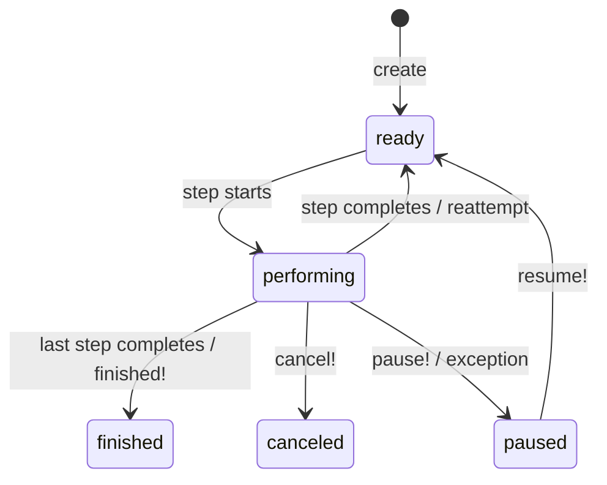

# GenevaDrive Manual

GenevaDrive provides durable, multi-step workflows for Rails applications. We built it because the prevailing "durable function" approach—where you write an `async` function and expect the runtime to persist it mid-execution—is fundamentally broken. The graph of steps and the code that executes each step must live in separate universes. GenevaDrive delivers on that architecture.

## The Problem with Long-Running Processes

Imagine you need to onboard a new user. You send a welcome email, wait three days, send a reminder if they haven't completed setup, then schedule a follow-up call. In a traditional Rails application, you face several challenges:

- **Web requests are ephemeral.** A request might take 50ms or 500ms, but it cannot wait three days.
- **Background jobs lack state continuity.** You can chain jobs together, but there's no central record of where you are in the process or what's already happened.
- **Multi-step processes need coordination.** If step two fails, how do you retry it without re-running step one? How do you skip step three if conditions change?
- **Idempotency is hard to get right.** If a job runs twice due to a queue hiccup, you might send two welcome emails or charge a credit card twice.
- **ActiveJob does not provide a stable ID.** Retried jobs can create duplicate job IDs even though the jobs are distinct. You cannot use the job ID as an idempotency key.

## The problem with "durable functions"

There is a rather popular approach to building durable execution systems based on the concept of "durable functions". Systems like [Temporal](https://temporal.io) and [absurd](https://lucumr.pocoo.org/2025/11/3/absurd-workflows/) as well as [Vercel Workflows](https://vercel.com/docs/workflow) take that concept quite far. It seems neat on the surface, yet deeply flawed in nature.

The assumption made with those "durable functions" is that it is possible to _pretend that you have a marshalable stack._ For example, this section in a workflow function:

```js
let step = 0;
while (step++ < 20) {
  const { newMessages, finishReason } = await ctx.step("iteration", async () => {
    return await singleStep(messages);
  });
  messages.push(...newMessages);
  if (finishReason !== "tool-calls") {
    break;
  }
}
```

can only work if `step` gets marshaled and reinstated if the function gets resumed. Async generators (and Fibers in Ruby, and - in general - any systems based on continuations or coroutines) allow suspension and resumption, but none allow proper _serialization and revival._ If you try to encode a durable function, consisting of multiple steps, as a suspendable and resumable workflow, you essentially have 3 ways to do it:

* Make your function restartable from the very beginning (idempotent)
* Use a serializable system stack frame, which - usually - comes down to serializing a VM image upon suspension
* Make the user write functions that only - and ever - use special facilities for accessing transients (current time, database connections, heavy resources)

Most "workflow engines" do their utmost to maintain the guise of resumable functions _while not providing them._ The fact that you have to wait on a Fiber to receive an HTTP result is not very useful if the only program that can receive that result is the very process which has started that HTTP request.

Instead, it is useful to look at workflow systems in terms of _DAGs_ (directed acyclic graphs). In that vision, the code driving the DAG and the code driving the nodes in that DAG is strictly separate, and runs in different domains. While the DAG definition code is "single use" and runs during the orchestration, the actual code of the nodes _is_ required to be explicitly restartable, and is required to be explicitly idempotent. There is no pretense that "this function being wrapped in this callback will cleanly resume", and there is way less possibility to "accidentally" call something non-idempotent when defining the nodes.

A geneva_drive workflow is a DAG with a single permitted input and a single permitted output per node, nothing more. It explicitly ditches the illusion of a marshalable VM universe in favor of clarity, cohesion with the host environment (UNIX system running Ruby running Rails) and deliberately picks clarity over pretense of magic.

## What GenevaDrive Provides

GenevaDrive addresses these challenges with a small set of guarantees:

- **One execution at a time per workflow.** Database constraints ensure a workflow never runs concurrently with itself.
- **Steps are explicitly idempotent via step executions.** Each attempt to run a step creates a separate record that serves as both an idempotency key and an audit trail.
- **Full visibility into workflow state.** You can query which step is running, which steps have completed, and what errors occurred.
- **Database-backed durability.** The workflow state survives process crashes, deployments, and server restarts.

---

## Core Concepts

### Workflows

A Workflow is an ActiveRecord model representing a durable process. You define a workflow by subclassing `GenevaDrive::Workflow` and declaring steps. Each workflow instance is tied to a single record—the hero—that the workflow operates on.

```ruby
class SubscriptionRenewalWorkflow < GenevaDrive::Workflow
  step :send_renewal_notice do
    RenewalMailer.notice(hero).deliver_later
  end

  step :charge_payment, wait: 3.days do
    PaymentGateway.charge(hero.payment_method, hero.renewal_amount)
  end

  step :activate_new_period do
    hero.subscription.extend!(1.month)
    ConfirmationMailer.renewed(hero).deliver_later
  end
end
```

When you create a workflow, GenevaDrive immediately schedules the first step:

```ruby
SubscriptionRenewalWorkflow.create!(hero: user)
```

For a complete example showing workflows in action, see the [User Onboarding Workflow](#user-onboarding-workflow) in the appendix.

### Steps

Steps are units of work executed sequentially. Each step can optionally specify a wait time before execution. GenevaDrive runs steps one at a time, in order, with the database enforcing that no two steps ever execute simultaneously for the same workflow.

```ruby
class DocumentProcessingWorkflow < GenevaDrive::Workflow
  step :extract_text do
    hero.update!(extracted_text: TextExtractor.extract(hero.file))
  end

  step :analyze_content, wait: 5.minutes do
    # Give the extraction time to settle in search indexes
    hero.update!(analysis: ContentAnalyzer.analyze(hero.extracted_text))
  end

  step :generate_summary, wait: 10.minutes do
    hero.update!(summary: Summarizer.generate(hero.analysis))
  end
end
```

### The Hero

The hero is the record the workflow operates on. We call it "hero" rather than "target" or "subject" because it emphasizes that the workflow exists to serve this record—it's the protagonist of the story.

```ruby
PaymentWorkflow.create!(hero: payment)
```

Inside any step, you access the hero directly:

```ruby
step :process do
  hero.mark_processing!
  hero.account.notify_payment_started!
end
```

The hero can be any ActiveRecord model. Choose the most specific record that represents what the workflow is about. If you're processing an invoice, the hero should be the `Invoice`, not the `User` who owns it.

### Step Executions

Step executions are the idempotency mechanism. Each attempt to run a step creates a `StepExecution` record. This record serves multiple purposes:

- **One execution per attempt.** Even if a job runs twice, the second execution sees that a step execution already exists and bails out.
- **Audit trail.** You can query the execution history to see exactly what happened and when.
- **Prevents duplicate execution.** Database constraints ensure only one step execution can be active per workflow.
- **Records timing, outcome, errors.** Each execution tracks when it started, finished, and what the result was.

```ruby
workflow.execution_history.each do |exec|
  puts "#{exec.step_name}: #{exec.state} (#{exec.outcome})"
  puts "  Started: #{exec.started_at}"
  puts "  Completed: #{exec.completed_at}"
  puts "  Error: #{exec.error_message}" if exec.failed?
end
```

---

## Defining Steps

### Named Steps

Most steps have explicit names that describe what they do:

```ruby
class AccountVerificationWorkflow < GenevaDrive::Workflow
  step :verify_email do
    EmailVerifier.send_code(hero)
  end

  step :verify_phone do
    PhoneVerifier.send_code(hero)
  end

  step :verify_identity do
    IdentityVerifier.request_documents(hero)
  end
end
```

### Anonymous Steps

When step names don't add clarity—typically in polling or retry scenarios—you can omit the name:

```ruby
class StatusPollingWorkflow < GenevaDrive::Workflow
  step { check_status! }
  step(wait: 1.minute) { check_status! }
  step(wait: 5.minutes) { check_status! }

  step :mark_timeout do
    hero.update!(status: :timed_out)
  end

  private

  def check_status!
    finished! if hero.external_status == "complete"
  end
end
```

GenevaDrive assigns auto-generated names like `step_1`, `step_2`, etc.

### Polling with Programmatic Steps

Ruby executes class body code at load time. This means you can use loops to generate steps—particularly useful for polling patterns with staggered intervals:

```ruby
class WebhookDeliveryWorkflow < GenevaDrive::Workflow
  # Immediate first attempt
  step { attempt_delivery! }

  # Retry every 30 seconds for 2 minutes
  4.times do
    step(wait: 30.seconds) { attempt_delivery! }
  end

  # Then every 5 minutes for 30 minutes
  6.times do
    step(wait: 5.minutes) { attempt_delivery! }
  end

  # Then hourly for 6 hours
  6.times do
    step(wait: 1.hour) { attempt_delivery! }
  end

  # Final step: mark as failed
  step :mark_undeliverable do
    hero.update!(delivery_status: :failed)
    WebhookFailureNotifier.notify(hero)
  end

  private

  def attempt_delivery!
    response = HttpClient.post(hero.endpoint_url, hero.payload)
    if response.success?
      hero.update!(delivery_status: :delivered, delivered_at: Time.current)
      finished!
    end
    # Otherwise, fall through to next step
  end
end
```

The loop bodies execute once when Ruby loads the class. Each iteration adds a new step definition. When a workflow instance runs, it executes those pre-defined steps in order.

### Instance Methods as Steps

For complex steps, you can define instance methods and reference them with `step def`:

```ruby
class DataExportWorkflow < GenevaDrive::Workflow
  step def gather_records
    hero.update!(export_data: hero.exportable_records.to_json)
  end

  step def write_to_storage
    Storage.write(hero.export_path, hero.export_data)
    hero.update!(exported_at: Time.current)
  end

  step def notify_user
    ExportMailer.complete(hero).deliver_later
  end
end
```

### Step Ordering with `before_step:` and `after_step:`

Steps normally execute in definition order. You can override this by specifying where a step should be inserted relative to another:

```ruby
class ComplianceWorkflow < GenevaDrive::Workflow
  step :collect_data do
    hero.update!(data: DataCollector.gather(hero))
  end

  step :submit_report do
    ComplianceApi.submit(hero.data)
  end

  # Insert audit check before submission
  step :audit_check, before_step: :submit_report do
    raise "Data incomplete" unless hero.data_complete?
    AuditLog.record(hero, :pre_submission)
  end
end
```

The referenced step must already be defined—you can only insert before or after steps that appear earlier in the class body.

---

## Flow Control

### Overview

GenevaDrive provides five flow control methods that let you change workflow behavior from inside a step:

- `cancel!` — Stop the workflow, mark it canceled
- `pause!` — Stop the workflow, await manual intervention
- `reattempt!(wait:)` — Retry the current step
- `skip!` — Skip the current step, proceed to the next
- `finished!` — Complete the workflow early

These methods use Ruby's throw/catch mechanism to interrupt step execution cleanly. When you call one of these methods, execution immediately stops and GenevaDrive updates the workflow state accordingly.

For a complete example showing flow control in a realistic scenario, see the [Payment Processing Workflow](#payment-processing-workflow) in the appendix.

### Canceling a Workflow

Use `cancel!` when conditions make the workflow irrelevant:

```ruby
class TrialConversionWorkflow < GenevaDrive::Workflow
  step :send_trial_reminder, wait: 7.days do
    cancel! if hero.converted_to_paid?
    TrialMailer.reminder(hero).deliver_later
  end

  step :send_final_reminder, wait: 3.days do
    cancel! if hero.converted_to_paid?
    TrialMailer.final_reminder(hero).deliver_later
  end

  step :expire_trial do
    hero.expire_trial! unless hero.converted_to_paid?
  end
end
```

### Pausing for Manual Intervention

Use `pause!` when a human needs to review something before the workflow continues:

```ruby
class FraudReviewWorkflow < GenevaDrive::Workflow
  step :automated_check do
    risk_score = FraudDetector.score(hero)
    hero.update!(risk_score: risk_score)

    if risk_score > 80
      hero.flag_for_review!
      pause!
    end
  end

  step :process_transaction do
    TransactionProcessor.process!(hero)
  end
end
```

When a workflow is paused, it stays paused until you explicitly resume it:

```ruby
workflow = FraudReviewWorkflow.find(id)
workflow.resume!  # Schedules the next step
```

### Reattempting Steps

Use `reattempt!` to retry the current step, optionally after a delay:

```ruby
class ExternalApiWorkflow < GenevaDrive::Workflow
  step :sync_to_crm do
    result = CrmApi.sync(hero)

    if result.rate_limited?
      reattempt!(wait: result.retry_after)
    end

    hero.update!(crm_synced_at: Time.current)
  end
end
```

Each reattempt creates a new step execution record, maintaining the full history of attempts.

### Skipping Steps

Use `skip!` to bypass a step and move to the next one:

```ruby
class OnboardingWorkflow < GenevaDrive::Workflow
  step :request_phone_verification do
    skip! if hero.phone_verified?
    SmsService.send_verification_code(hero)
  end

  step :wait_for_verification, wait: 5.minutes do
    skip! if hero.phone_verified?
    reattempt!(wait: 1.minute)
  end

  step :complete_onboarding do
    hero.complete_onboarding!
  end
end
```

### Early Completion

Use `finished!` to complete the workflow before reaching the last step:

```ruby
class OrderFulfillmentWorkflow < GenevaDrive::Workflow
  step :check_delivery_status do
    if hero.delivered?
      hero.complete!
      finished!
    end
    reattempt!(wait: 1.hour)
  end

  step :escalate_delayed_delivery do
    SupportTeam.escalate(hero)
  end
end
```

---

## Workflow States

### State Machine Diagram



A workflow begins in `ready` state. When a step starts executing, it transitions to `performing`. Upon step completion, it returns to `ready` (unless it was the last step, in which case it transitions to `finished`).

### Step Execution States

Step executions have their own state machine:

| State | Meaning |
|-------|---------|
| `scheduled` | Waiting to run |
| `in_progress` | Currently executing |
| `completed` | Finished successfully |
| `failed` | Exception occurred |
| `canceled` | Canceled before execution |
| `skipped` | Skipped via `skip_if` or `skip!` |

---

## Conditional Execution

### Skipping Steps with `skip_if:`

You can declare conditions that cause a step to be skipped without entering the step body:

```ruby
class NotificationWorkflow < GenevaDrive::Workflow
  step :send_email, skip_if: -> { hero.email_unsubscribed? } do
    NotificationMailer.notify(hero).deliver_later
  end

  step :send_sms, skip_if: :sms_disabled? do
    SmsService.notify(hero)
  end

  private

  def sms_disabled?
    !hero.sms_enabled? || hero.phone.blank?
  end
end
```

The `skip_if` option accepts a lambda, a symbol (method name), or a boolean. The condition is evaluated before the step executes.

For a complete example showing conditional steps in context, see the [User Onboarding Workflow](#user-onboarding-workflow) in the appendix.

### Blanket Cancellation with `cancel_if`

When certain conditions should cancel the entire workflow regardless of which step is running, use `cancel_if`:

```ruby
class EngagementWorkflow < GenevaDrive::Workflow
  cancel_if { hero.deactivated? }
  cancel_if { hero.unsubscribed? }

  step :send_week_1_email do
    EngagementMailer.week_1(hero).deliver_later
  end

  step :send_week_2_email, wait: 7.days do
    EngagementMailer.week_2(hero).deliver_later
  end

  step :send_week_4_email, wait: 14.days do
    EngagementMailer.week_4(hero).deliver_later
  end
end
```

GenevaDrive evaluates `cancel_if` conditions before every step. If any condition returns true, the workflow cancels immediately.

---

## The Asynchronous Execution Model

### Key Assumptions

GenevaDrive steps execute asynchronously via ActiveJob. This has important implications:

- **Every step runs on a different machine/process/thread.** Don't assume anything about the execution environment between steps.
- **Instance variables don't persist between steps.** Each step gets a freshly-loaded workflow instance.
- **The workflow is always loaded fresh from the database.** Any changes you make to the workflow or hero are persisted and reloaded.
- **Steps may be separated by seconds or months.** A `wait: 30.days` step means exactly what it says.

### No Shared State Between Steps

> [!WARNING]
> Instance variables do not persist between steps. Store data in the database.

```ruby
# WRONG - @data won't exist in next step
step :fetch do
  @data = ExternalApi.fetch(hero.external_id)
end

step :process do
  process(@data)  # @data is nil here!
end

# RIGHT - persist to the hero or another record
step :fetch do
  hero.update!(external_data: ExternalApi.fetch(hero.external_id))
end

step :process do
  process(hero.external_data)
end
```

You will almost never have the same `self` between steps. Treat each step as an independent unit that reads from and writes to the database.

---

## Exception Handling

### Default Behavior

By default, unhandled exceptions pause the workflow. The step execution records the error message and backtrace, and the workflow waits for manual intervention:

```ruby
step :risky_operation do
  ExternalService.call!(hero)  # If this raises, workflow pauses
end
```

### Configuring Exception Policy

You can change how a step handles exceptions using `on_exception`:

```ruby
class ResilientApiWorkflow < GenevaDrive::Workflow
  step :call_external_api, on_exception: :reattempt! do
    ExternalApi.call(hero)
  end
end
```

Available exception handlers:

- `:pause!` — (default) Pause the workflow for manual review
- `:cancel!` — Cancel the workflow
- `:reattempt!` — Retry the step
- `:skip!` — Skip the step and continue to the next

### Manual Exception Handling

For granular control, handle exceptions within the step:

```ruby
class PaymentWorkflow < GenevaDrive::Workflow
  step def initiate_payment
    PaymentGateway.charge(hero)
  rescue PaymentGateway::RateLimited => e
    reattempt!(wait: e.retry_after)
  rescue PaymentGateway::CardDeclined
    hero.notify_card_declined!
    cancel!
  rescue PaymentGateway::ServiceDown
    pause!  # Wait for manual intervention
  end
end
```

For a complete example showing granular exception handling, see the [Payment Processing Workflow](#payment-processing-workflow) in the appendix.

### Recovering Paused Workflows

Find and resume paused workflows from the console:

```ruby
GenevaDrive::Workflow.paused.each do |workflow|
  puts "#{workflow.class.name} ##{workflow.id}: next step is #{workflow.next_step_name}"
  puts "  Error: #{workflow.step_executions.failed.last&.error_message}"
end

# Resume a specific workflow
workflow = GenevaDrive::Workflow.find(id)
workflow.resume!
```

---

## Working with Heroes

### Choosing the Right Hero

Make the hero the specific business object being processed, not the user who owns it. This keeps workflows focused and allows multiple concurrent workflows for the same user.

```ruby
# Good: Invoice is the hero
invoice = user.invoices.create!(amount: 100)
InvoiceWorkflow.create!(hero: invoice)

# Less good: User is the hero, but the workflow is really about an invoice
InvoiceWorkflow.create!(hero: user, invoice_id: invoice.id)
```

If you're processing a subscription renewal, the hero is the `Subscription`. If you're processing an order, the hero is the `Order`. The more specific your hero, the easier it is to reason about workflow state.

### Workflows Without Heroes

Some workflows don't operate on a specific record—system maintenance, batch jobs, or scheduled reports:

```ruby
class SystemMaintenanceWorkflow < GenevaDrive::Workflow
  may_proceed_without_hero!

  step :cleanup_temp_files do
    TempFileService.cleanup_older_than(7.days)
  end

  step :vacuum_database do
    ActiveRecord::Base.connection.execute("VACUUM ANALYZE")
  end

  step :notify_ops do
    OpsMailer.maintenance_complete.deliver_later
  end
end

# Create without a hero
SystemMaintenanceWorkflow.create!
```

### When Heroes Disappear

If the hero is deleted while the workflow is running, GenevaDrive cancels the workflow. This prevents steps from failing with `RecordNotFound` errors.

If your workflow needs to continue after the hero is deleted (for example, a GDPR erasure workflow), declare it explicitly:

```ruby
class DataErasureWorkflow < GenevaDrive::Workflow
  may_proceed_without_hero!

  step :archive_for_compliance do
    ComplianceArchive.store(hero)
  end

  step :delete_from_primary do
    hero.destroy!  # Hero no longer exists after this
  end

  step :purge_from_backups do
    # hero is nil here, but we stored the ID we need
    BackupService.purge(id: @archived_hero_id)
  end
end
```

For an example of a workflow that handles data deletion carefully, see the [Data Retention Workflow](#data-retention-workflow) in the appendix.

---

## Installation and Setup

### Adding the Gem

```bash
bundle add geneva_drive
bin/rails generate geneva_drive:install
bin/rails db:migrate
```

The generator creates two migrations: one for workflows and one for step executions.

### Database Tables

GenevaDrive uses a two-table design:

- **`geneva_drive_workflows`** — The workflow records. Each row represents one workflow instance with its current state, hero association, and progress tracking.
- **`geneva_drive_step_executions`** — The idempotency keys. Each row represents one attempt to execute a step, with timing, outcome, and error information.

This separation keeps the workflows table clean while maintaining a complete audit trail in step executions.

### UUID Primary Keys

If your application uses UUID primary keys, pass the `--uuid` flag:

```bash
bin/rails generate geneva_drive:install --uuid
```

This configures both tables to use UUID primary keys and ensures foreign key references work correctly.

---

## ActiveJob Integration

### How Steps Are Scheduled

When a step completes, GenevaDrive creates a new `StepExecution` record and enqueues a `PerformStepJob`. The job runs after the transaction commits (using `after_all_transactions_commit`), ensuring the step execution record is visible to the job worker.

If a step specifies `wait:`, GenevaDrive passes the delay to ActiveJob's `set(wait_until:)`. This means your queue adapter handles the scheduling—GenevaDrive doesn't implement its own timer.

### Recommended Queue Adapters

We recommend using a queue adapter that co-commits with your database:

- **Solid Queue** — Built for Rails, uses your existing database
- **GoodJob** — PostgreSQL-based, with excellent admin UI
- **Gouda** — Another PostgreSQL option with simple semantics

Co-committing matters because GenevaDrive relies on transactional guarantees. When a step completes and schedules the next step, both the state change and the job enqueue should be atomic. With co-committing adapters, if the transaction rolls back, the job is never enqueued.

With non-transactional adapters (Sidekiq, Resque), there's a small window where the job is enqueued but the transaction hasn't committed. GenevaDrive handles this gracefully—the job will see the step execution in the wrong state and skip it—but you may see occasional log warnings.

### Custom Job Options

Override the queue or priority for all steps in a workflow:

```ruby
class HighPriorityWorkflow < GenevaDrive::Workflow
  set_step_job_options queue: :critical, priority: 0

  step :urgent_action do
    UrgentService.process!(hero)
  end
end
```

The options are passed directly to ActiveJob's `set` method.

---

## Housekeeping

### The Housekeeping Job

`GenevaDrive::HousekeepingJob` performs two maintenance tasks:

1. **Cleanup**: Deletes completed and canceled workflows (along with their step executions) older than a configured threshold.
2. **Recovery**: Finds and recovers stuck step executions—those that are in `in_progress` or `scheduled` state for too long, indicating a process crash or lost job.

### Configuration

Configure housekeeping thresholds in an initializer:

```ruby
# config/initializers/geneva_drive.rb
GenevaDrive.delete_completed_workflows_after = 30.days
GenevaDrive.stuck_in_progress_threshold = 1.hour
GenevaDrive.stuck_scheduled_threshold = 1.hour
GenevaDrive.stuck_recovery_action = :reattempt  # or :cancel
```

- **`delete_completed_workflows_after`** — How long to keep finished/canceled workflows. Set to `nil` to disable cleanup.
- **`stuck_in_progress_threshold`** — How long a step can be `in_progress` before it's considered stuck.
- **`stuck_scheduled_threshold`** — How long past `scheduled_for` a step can be while still `scheduled` before it's considered stuck.
- **`stuck_recovery_action`** — What to do with stuck steps: `:reattempt` reschedules them, `:cancel` cancels the workflow.

### Running Housekeeping

Schedule the housekeeping job to run periodically:

```ruby
# With GoodJob cron
GoodJob::Cron.schedule(
  cron: "*/30 * * * *",
  class: "GenevaDrive::HousekeepingJob"
)

# Or enqueue manually
GenevaDrive::HousekeepingJob.perform_later
```

---

## Testing

### Test Helpers

Include `GenevaDrive::TestHelpers` in your test class:

```ruby
class SignupWorkflowTest < ActiveSupport::TestCase
  include GenevaDrive::TestHelpers
end
```

### Running Workflows Synchronously

`speedrun_workflow` executes all pending steps synchronously, ignoring wait times:

```ruby
test "subscription workflow sends emails and activates" do
  user = users(:active_subscriber)
  workflow = SubscriptionRenewalWorkflow.create!(hero: user)

  speedrun_workflow(workflow)

  assert workflow.finished?
  assert user.subscription.reload.active?
end
```

### Testing Individual Steps

`perform_step_inline` executes a specific step without running through the entire workflow:

```ruby
test "payment step handles rate limiting" do
  payment = payments(:pending)
  workflow = PaymentWorkflow.create!(hero: payment)

  PaymentGateway.stub(:charge, -> { raise PaymentGateway::RateLimited.new(retry_after: 60) }) do
    perform_step_inline(workflow, :initiate_payment)
  end

  workflow.reload
  assert workflow.ready?
  assert_equal "initiate_payment", workflow.next_step_name
end
```

### Assertions

The test helpers provide convenience assertions:

```ruby
test "skips email if user unsubscribed" do
  user = users(:unsubscribed)
  workflow = NotificationWorkflow.create!(hero: user)

  speedrun_workflow(workflow)

  assert_step_executed(workflow, :send_email, state: "skipped")
  assert_workflow_state(workflow, :finished)
end
```

---

## Observability

### Logging

GenevaDrive uses tagged logging. Each log entry includes the workflow class, ID, and hero information:

```
[SubscriptionRenewalWorkflow id=123 hero_type=User hero_id=456] Scheduling next step "charge_payment" after "send_renewal_notice"
```

When a step executes, the log entries also include the step execution ID and step name:

```
[SubscriptionRenewalWorkflow id=123 hero_type=User hero_id=456] [execution_id=789 step_name=charge_payment] Step completed successfully
```

### ActiveSupport Instrumentation

GenevaDrive emits three instrumentation events:

| Event | When | Payload |
|-------|------|---------|
| `precondition.geneva_drive` | Before step, during cancel_if/skip_if evaluation | `execution_id`, `workflow_id`, `workflow_class`, `step_name`, `outcome` |
| `step.geneva_drive` | During step execution | `execution_id`, `workflow_id`, `workflow_class`, `step_name`, `outcome`, `exception` |
| `finalize.geneva_drive` | After step, during state transitions | `execution_id`, `workflow_id`, `workflow_class`, `step_name`, `workflow_state`, `step_state` |

Subscribe to events for custom metrics or logging:

```ruby
ActiveSupport::Notifications.subscribe("step.geneva_drive") do |event|
  StatsD.timing("geneva_drive.step.duration", event.duration)
  StatsD.increment("geneva_drive.step.#{event.payload[:outcome]}")

  if event.payload[:exception]
    Sentry.capture_exception(event.payload[:exception])
  end
end
```

---

## Appendix

### Complete Example Workflows

#### User Onboarding Workflow

This workflow demonstrates named steps with wait times, skip conditions, and blanket cancellation. It guides a new user through account setup with timed reminders.

```ruby
class UserOnboardingWorkflow < GenevaDrive::Workflow
  cancel_if { hero.account_closed? }
  cancel_if { hero.onboarding_completed? }

  step :send_welcome_email do
    OnboardingMailer.welcome(hero).deliver_later
    hero.update!(welcome_email_sent_at: Time.current)
  end

  step :check_profile_completion, wait: 1.day do
    skip! if hero.profile_complete?
    OnboardingMailer.complete_profile_reminder(hero).deliver_later
  end

  step :verify_email, wait: 2.days, skip_if: :email_verified? do
    OnboardingMailer.verify_email_reminder(hero).deliver_later
  end

  step :suggest_connections, wait: 3.days, skip_if: -> { hero.connections.any? } do
    ConnectionSuggester.generate_for(hero)
    OnboardingMailer.connection_suggestions(hero).deliver_later
  end

  step :schedule_onboarding_call, wait: 5.days do
    skip! if hero.onboarding_call_scheduled? || hero.onboarding_completed?
    CalendarService.schedule_onboarding(hero)
    OnboardingMailer.call_scheduled(hero).deliver_later
  end

  step :mark_onboarding_complete, wait: 7.days do
    hero.update!(onboarding_completed_at: Time.current)
    OnboardingMailer.onboarding_complete(hero).deliver_later
  end

  private

  def email_verified?
    hero.email_verified?
  end
end
```

#### Payment Processing Workflow

This workflow demonstrates manual exception handling, dynamic retry waits, and early termination. It handles the complexity of interacting with an external payment gateway.

```ruby
class PaymentProcessingWorkflow < GenevaDrive::Workflow
  cancel_if { hero.canceled? }
  cancel_if { hero.refunded? }

  step :validate_payment_method do
    unless hero.payment_method&.valid?
      hero.mark_invalid_payment_method!
      cancel!
    end
  end

  step :authorize_payment do
    result = PaymentGateway.authorize(
      amount: hero.amount,
      payment_method: hero.payment_method,
      idempotency_key: "authorize-#{hero.id}"
    )

    hero.update!(authorization_id: result.authorization_id)
  rescue PaymentGateway::CardDeclined => e
    hero.update!(failure_reason: e.message)
    PaymentMailer.card_declined(hero).deliver_later
    cancel!
  rescue PaymentGateway::RateLimited => e
    reattempt!(wait: e.retry_after || 30.seconds)
  rescue PaymentGateway::ServiceUnavailable
    reattempt!(wait: 5.minutes)
  end

  step :capture_payment, wait: 1.hour do
    # Allow time for fraud checks
    result = PaymentGateway.capture(
      authorization_id: hero.authorization_id,
      idempotency_key: "capture-#{hero.id}"
    )

    hero.update!(
      captured_at: Time.current,
      transaction_id: result.transaction_id
    )
  rescue PaymentGateway::AuthorizationExpired
    # Re-authorize if the hold expired
    hero.update!(authorization_id: nil)
    reattempt!
  rescue PaymentGateway::FraudSuspected
    hero.flag_for_fraud_review!
    pause!
  end

  step :send_receipt do
    PaymentMailer.receipt(hero).deliver_later
  end

  step :update_inventory do
    hero.line_items.each do |item|
      InventoryService.decrement(item.sku, item.quantity)
    end
  end

  step :notify_fulfillment do
    FulfillmentService.queue(hero)
    hero.update!(fulfillment_queued_at: Time.current)
  end
end
```

#### Data Retention Workflow

This workflow demonstrates handling hero deletion mid-workflow. It processes GDPR-style data erasure requests while maintaining compliance records.

```ruby
class DataRetentionWorkflow < GenevaDrive::Workflow
  may_proceed_without_hero!

  step :create_compliance_record do
    ComplianceRecord.create!(
      user_id: hero.id,
      user_email: hero.email,
      request_type: "erasure",
      requested_at: Time.current,
      workflow_id: id
    )
  end

  step :export_to_archive do
    archive_data = UserDataExporter.export(hero)
    ComplianceArchive.store(
      user_id: hero.id,
      data: archive_data,
      expires_at: 7.years.from_now
    )
  end

  step :notify_third_parties do
    # Request deletion from integrated services
    hero.oauth_connections.each do |connection|
      ThirdPartyDeletionService.request(connection)
    end
  end

  step :delete_user_data, wait: 24.hours do
    # Give third parties time to process
    # hero may be nil if already deleted
    return unless hero

    hero.posts.destroy_all
    hero.comments.destroy_all
    hero.messages.destroy_all
    hero.files.each { |f| f.purge_later }
  end

  step :delete_user_record do
    return unless hero

    hero_id = hero.id
    hero.destroy!

    # Update compliance record
    ComplianceRecord.find_by(user_id: hero_id, workflow_id: id)
      &.update!(completed_at: Time.current)
  end

  step :send_confirmation do
    record = ComplianceRecord.find_by(workflow_id: id)
    return unless record

    ComplianceMailer.erasure_complete(record.user_email).deliver_later
  end
end
```

### Quick Reference

#### Flow Control Methods

| Method | Effect |
|--------|--------|
| `cancel!` | Stop workflow, mark canceled |
| `pause!` | Stop workflow, await manual resume |
| `reattempt!(wait:)` | Retry current step, optionally after delay |
| `skip!` | Skip current step, proceed to next |
| `finished!` | Complete workflow early |

#### Workflow States

| State | Meaning |
|-------|---------|
| `ready` | Waiting for next step to execute |
| `performing` | Currently executing a step |
| `finished` | All steps completed successfully |
| `canceled` | Workflow was canceled |
| `paused` | Awaiting manual intervention |

#### Step Execution States

| State | Meaning |
|-------|---------|
| `scheduled` | Waiting to run |
| `in_progress` | Currently executing |
| `completed` | Finished successfully |
| `failed` | Exception occurred |
| `canceled` | Canceled before execution |
| `skipped` | Skipped via `skip_if` or `skip!` |

#### Step Options

| Option | Type | Description |
|--------|------|-------------|
| `wait:` | Duration | Delay before step executes |
| `skip_if:` | Proc, Symbol, Boolean | Condition to skip step |
| `on_exception:` | Symbol | Exception handler (`:pause!`, `:cancel!`, `:reattempt!`, `:skip!`) |
| `before_step:` | Symbol | Insert before this step |
| `after_step:` | Symbol | Insert after this step |
