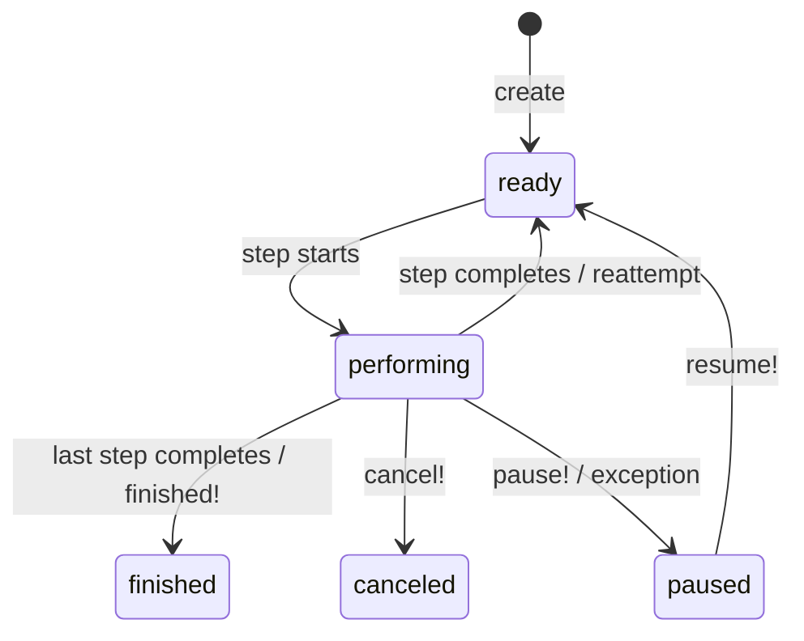

# Introduction

GenevaDrive provides durable, multi-step workflows for Rails applications. The graph of steps and the code that executes each step live in separate universes — the structure is defined at class load time, the behavior runs later via ActiveJob. GenevaDrive delivers on that architecture.

# Part I — Why GenevaDrive Exists

## The Problem with Long-Running Processes

Imagine you need to onboard a new user. You send a welcome email, wait three days, send a reminder if they haven't completed setup, then schedule a follow-up call. In a traditional Rails application, you face several challenges:

- **Web requests are ephemeral.** A request might take 50ms or 500ms, but it cannot wait three days.
- **Background jobs lack state continuity.** You can chain jobs together, but there's no central record of where you are in the process or what's already happened.
- **Multi-step processes need coordination.** If step two fails, how do you retry it without re-running step one? How do you skip step three if conditions change?
- **Idempotency is hard to get right.** If a job runs twice due to a queue hiccup, you might send two welcome emails or charge a credit card twice.
- **ActiveJob does not provide a stable ID.** Retried jobs can create duplicate job IDs even though the jobs are distinct. You cannot use the job ID as an idempotency key.

## The DAG Approach

Instead of pretending that a function can be suspended, serialized, and resumed — which no mainstream runtime actually supports — GenevaDrive models workflows as DAGs (directed acyclic graphs). The code driving the DAG and the code driving each node are strictly separate and run in different domains.

A GenevaDrive workflow is a DAG with a single permitted input and a single permitted output per node. It explicitly ditches the illusion of a marshalable VM universe in favor of clarity, cohesion with the host environment (UNIX system running Ruby running Rails) and deliberately picks clarity over pretense of magic.

```ruby
class OrderFulfillmentWorkflow < GenevaDrive::Workflow  # DAG context — definition time
  cancel_if do                                          # DAG context — definition time
    hero.canceled?                                      # Node context — execution time
  end                                                   # DAG context — definition time

  step :reserve_inventory do                            # DAG context — definition time
    hero.line_items.each do |item|                      # Node context — execution time
      Inventory.decrement!(item.sku, item.quantity)     # Node context — execution time
    end                                                 # Node context — execution time
  end                                                   # DAG context — definition time

  step :charge_payment, wait: 1.hour do                 # DAG context — definition time
    PaymentGateway.capture(hero.payment_intent_id)      # Node context — execution time
  end                                                   # DAG context — definition time

  step :ship_order do                                   # DAG context — definition time
    Fulfillment.create_shipment(hero)                   # Node context — execution time
    OrderMailer.shipped(hero).deliver_later             # Node context — execution time
  end                                                   # DAG context — definition time
end                                                     # DAG context — definition time
```

This separation is the entire point. The DAG context runs once, when Ruby loads the class. It defines the structure: which steps exist, in what order, with what wait times and preconditions. The node context runs later — possibly much later, possibly on a different machine — when ActiveJob executes the step. You can see at a glance which code is "architecture" and which code is "behavior." There is no ambiguity about what persists and what doesn't, because the boundary is syntactic: everything inside a `do...end` block is node context; everything outside is DAG context. Instance variables set in node context will not exist in the next node. Database writes in node context will persist. The framework does not pretend otherwise.

## What GenevaDrive Provides

GenevaDrive addresses these challenges with a small set of guarantees:

- **One running or one scheduled step execution at a time per workflow.** Database constraints ensure a workflow never runs concurrently with itself.
- **Steps are explicitly idempotent via step executions.** Each attempt to run a step creates a separate record that serves as both an idempotency key and an audit trail.
- **Full visibility into workflow state.** You can query which step is running, which steps have completed, and what errors occurred.
- **Database-backed durability.** The workflow state survives process crashes, deployments, and server restarts.

---

# Part II — Getting Started

## Installation and Setup

### Adding the Gem

```bash
bundle add geneva_drive
bin/rails generate geneva_drive:install
bin/rails db:migrate
```

The generator creates two migrations: one for workflows and one for step executions.

### Database Tables

GenevaDrive uses a two-table design:

- **`geneva_drive_workflows`** — The workflow records. Each row represents one workflow instance with its current state, hero association, and progress tracking.
- **`geneva_drive_step_executions`** — The idempotency keys. Each row represents one attempt to execute a step, with timing, outcome, and error information.

This separation keeps the workflows table clean while maintaining a complete audit trail in step executions.

### UUID Primary Keys

If your application uses UUID primary keys, the migrations will detect this and also use UUIDs for the foreign keys and the primary keys of the geneva_drive resources.

Note that you don't want to mix integer IDs and UUIDs in the same application.

## Core Concepts

### Workflows

A Workflow is an ActiveRecord model representing a durable process. You define a workflow by subclassing `GenevaDrive::Workflow` and declaring steps. Each workflow instance is tied to a single record — the hero — that the workflow operates on.

```ruby
class SubscriptionRenewalWorkflow < GenevaDrive::Workflow
  step :send_renewal_notice do
    RenewalMailer.notice(hero).deliver_later
  end

  step :charge_payment, wait: 3.days do
    PaymentGateway.charge(hero.payment_method, hero.renewal_amount)
  end

  step :activate_new_period do
    hero.subscription.extend!(1.month)
    ConfirmationMailer.renewed(hero).deliver_later
  end
end
```

When you create a workflow, GenevaDrive immediately schedules the first step:

```ruby
SubscriptionRenewalWorkflow.create!(hero: user)
```

which produces the step execution job in your ActiveJob queue. Your worker will then pick up that job and perform the step on the already-persisted `Workflow` model. For a complete example showing workflows in action, see the [User Onboarding Workflow](#user-onboarding-workflow) in the appendix.

### Steps

Steps are units of work executed sequentially. Each step can optionally specify a wait time before execution. GenevaDrive runs steps one at a time, in order, with the database enforcing that no two steps ever execute simultaneously for the same workflow.

```ruby
class DocumentProcessingWorkflow < GenevaDrive::Workflow
  step :extract_text do
    hero.update!(extracted_text: TextExtractor.extract(hero.file))
  end

  step :analyze_content, wait: 5.minutes do
    # Give the extraction time to settle in search indexes
    hero.update!(analysis: ContentAnalyzer.analyze(hero.extracted_text))
  end

  step :generate_summary, wait: 10.minutes do
    hero.update!(summary: Summarizer.generate(hero.analysis))
  end
end
```

### The Hero

The hero is the record the workflow operates on. We call it "hero" rather than "target" or "subject" because it emphasizes that the workflow exists to serve this record — it's the protagonist of the story.

```ruby
PaymentWorkflow.create!(hero: payment)
```

Inside any step, you access the hero directly:

```ruby
step :process do
  hero.mark_processing!
  hero.account.notify_payment_started!
end
```

The hero can be any ActiveRecord model. Choose the most specific record that represents what the workflow is about. If you're processing an invoice, the hero should be the `Invoice`, not the `User` who owns it.

### Step Executions

Step executions are the idempotency mechanism. Each attempt to run a step creates a `StepExecution` record. This record serves multiple purposes:

- **One execution per attempt.** Even if a job runs twice, the second execution sees that a step execution already exists and bails out.
- **Audit trail.** You can query the execution history to see exactly what happened and when.
- **Prevents duplicate execution.** Database constraints ensure only one step execution can be active per workflow.
- **Records timing, outcome, errors.** Each execution tracks when it started, finished, and what the result was.

```ruby
workflow.execution_history.each do |exec|
  puts "#{exec.step_name}: #{exec.state} (#{exec.outcome})"
  puts "  Started: #{exec.started_at}"
  puts "  Completed: #{exec.completed_at}"
  puts "  Error: #{exec.error_message}" if exec.failed?
end
```

---

# Part III — Defining Workflows

## Defining Steps

### Named Steps

Most steps have explicit names that describe what they do:

```ruby
class AccountVerificationWorkflow < GenevaDrive::Workflow
  step :verify_email do
    EmailVerifier.send_code(hero)
  end

  step :verify_phone do
    PhoneVerifier.send_code(hero)
  end

  step :verify_identity do
    IdentityVerifier.request_documents(hero)
  end
end
```

### Anonymous Steps

When step names don't add clarity — typically in polling or retry scenarios — you can omit the name:

```ruby
class StatusPollingWorkflow < GenevaDrive::Workflow
  step { check_status! }
  step(wait: 1.minute) { check_status! }
  step(wait: 5.minutes) { check_status! }

  step :mark_timeout do
    hero.update!(status: :timed_out)
  end

  private

  def check_status!
    finished! if hero.external_status == "complete"
  end
end
```

GenevaDrive assigns auto-generated names like `step_1`, `step_2`, etc.

### Polling with Programmatic Steps

Ruby executes class body code at load time. This means you can use loops to generate steps — particularly useful for polling patterns with staggered intervals:

```ruby
class WebhookDeliveryWorkflow < GenevaDrive::Workflow
  # Immediate first attempt
  step { attempt_delivery! }

  # Retry every 30 seconds for 2 minutes
  4.times do
    step(wait: 30.seconds) { attempt_delivery! }
  end

  # Then every 5 minutes for 30 minutes
  6.times do
    step(wait: 5.minutes) { attempt_delivery! }
  end

  # Then hourly for 6 hours
  6.times do
    step(wait: 1.hour) { attempt_delivery! }
  end

  # Final step: mark as failed
  step :mark_undeliverable do
    hero.update!(delivery_status: :failed)
    WebhookFailureNotifier.notify(hero)
  end

  private

  def attempt_delivery!
    response = HttpClient.post(hero.endpoint_url, hero.payload)
    if response.success?
      hero.update!(delivery_status: :delivered, delivered_at: Time.current)
      finished!
    end
    # Otherwise, fall through to next step
  end
end
```

The loop bodies execute once when Ruby loads the class. Each iteration adds a new step definition. When a workflow instance runs, it executes those pre-defined steps in order.

### Instance Methods as Steps

For complex steps, you can define instance methods and reference them with `step def`:

```ruby
class DataExportWorkflow < GenevaDrive::Workflow
  step def gather_records
    hero.update!(export_data: hero.exportable_records.to_json)
  end

  step def write_to_storage
    Storage.write(hero.export_path, hero.export_data)
    hero.update!(exported_at: Time.current)
  end

  step def notify_user
    ExportMailer.complete(hero).deliver_later
  end
end
```

### Step Ordering with `before_step:` and `after_step:`

Steps normally execute in definition order. You can override this by specifying where a step should be inserted relative to another:

```ruby
class ComplianceWorkflow < GenevaDrive::Workflow
  step :collect_data do
    hero.update!(data: DataCollector.gather(hero))
  end

  step :submit_report do
    ComplianceApi.submit(hero.data)
  end

  # Insert audit check before submission
  step :audit_check, before_step: :submit_report do
    raise "Data incomplete" unless hero.data_complete?
    AuditLog.record(hero, :pre_submission)
  end
end
```

The referenced step must already be defined — you can only insert before or after steps that appear earlier in the class body.

## Conditional Execution

### Skipping Steps with `skip_if:`

You can declare conditions that cause a step to be skipped without entering the step body:

```ruby
class NotificationWorkflow < GenevaDrive::Workflow
  step :send_email, skip_if: -> { hero.email_unsubscribed? } do
    NotificationMailer.notify(hero).deliver_later
  end

  step :send_sms, skip_if: :sms_disabled? do
    SmsService.notify(hero)
  end

  private

  def sms_disabled?
    !hero.sms_enabled? || hero.phone.blank?
  end
end
```

The `skip_if` option accepts a lambda, a symbol (method name), or a boolean. The condition is evaluated before the step executes.

For a complete example showing conditional steps in context, see the [User Onboarding Workflow](#user-onboarding-workflow) in the appendix.

### Blanket Cancellation with `cancel_if`

When certain conditions should cancel the entire workflow regardless of which step is running, use `cancel_if`:

```ruby
class EngagementWorkflow < GenevaDrive::Workflow
  cancel_if { hero.deactivated? }
  cancel_if { hero.unsubscribed? }

  step :send_week_1_email do
    EngagementMailer.week_1(hero).deliver_later
  end

  step :send_week_2_email, wait: 7.days do
    EngagementMailer.week_2(hero).deliver_later
  end

  step :send_week_4_email, wait: 14.days do
    EngagementMailer.week_4(hero).deliver_later
  end
end
```

GenevaDrive evaluates `cancel_if` conditions before every step. If any condition returns true, the workflow cancels immediately.

## Flow Control

### Overview

GenevaDrive provides five flow control methods that let you change workflow behavior from inside a step:

- `cancel!` — Stop the workflow, mark it canceled
- `pause!` — Stop the workflow, await manual intervention
- `reattempt!(wait:)` — Retry the current step
- `skip!` — Skip the current step, proceed to the next
- `finished!` — Complete the workflow early

These methods use Ruby's throw/catch mechanism to interrupt step execution cleanly. When you call one of these methods, execution immediately stops and GenevaDrive updates the workflow state accordingly.

For a complete example showing flow control in a realistic scenario, see the [Payment Processing Workflow](#payment-processing-workflow) in the appendix.

### Canceling a Workflow

Use `cancel!` when conditions make the workflow irrelevant:

```ruby
class TrialConversionWorkflow < GenevaDrive::Workflow
  step :send_trial_reminder, wait: 7.days do
    cancel! if hero.converted_to_paid?
    TrialMailer.reminder(hero).deliver_later
  end

  step :send_final_reminder, wait: 3.days do
    cancel! if hero.converted_to_paid?
    TrialMailer.final_reminder(hero).deliver_later
  end

  step :expire_trial do
    hero.expire_trial! unless hero.converted_to_paid?
  end
end
```

### Pausing for Manual Intervention

Use `pause!` when a human needs to review something before the workflow continues:

```ruby
class FraudReviewWorkflow < GenevaDrive::Workflow
  step :automated_check do
    risk_score = FraudDetector.score(hero)
    hero.update!(risk_score: risk_score)

    if risk_score > 80
      hero.flag_for_review!
      pause!
    end
  end

  step :process_transaction do
    TransactionProcessor.process!(hero)
  end
end
```

When a workflow is paused, it stays paused until you explicitly resume it:

```ruby
workflow = FraudReviewWorkflow.find(id)
workflow.resume!  # Re-enqueues the scheduled step
```

### How Pause and Resume Work

When you call `pause!` externally on a workflow that's waiting for a scheduled step, GenevaDrive preserves the scheduled step execution rather than canceling it. This provides better timeline visibility — you can see that a step was scheduled, became overdue during the pause period, and when it eventually ran.

**Pause behavior:**
- The workflow transitions from `ready` to `paused`
- The scheduled step execution remains in `scheduled` state
- If the scheduled time passes while paused, the execution becomes "overdue" (visible in the timeline)

**Resume behavior:**
- The workflow transitions from `paused` back to `ready`
- If a scheduled execution exists:
  - If still in the future → a job is enqueued with remaining wait time
  - If overdue (scheduled time has passed) → a job is enqueued to run immediately
- If no scheduled execution exists (executor canceled it while paused) → a new execution is created

```ruby
# Timeline example:
# T+0h: step_one completes, step_two scheduled for T+2h
# T+1h: pause! called (step_two still scheduled for T+2h)
# T+3h: resume! called (step_two is overdue, runs immediately)

workflow = WaitingWorkflow.create!(hero: user)
perform_next_step(workflow)           # step_one runs, step_two scheduled

# Later...
workflow.pause!                        # step_two stays scheduled
workflow.step_executions.last.state   # => "scheduled"

# Much later (after scheduled time passed)...
workflow.resume!                       # step_two re-enqueued to run now
```

This behavior means:
- Multiple pause/resume cycles reuse the same step execution (no duplicates)
- The scheduled_for timestamp shows when the step was originally intended to run
- Overdue steps are clearly visible — their scheduled_for is in the past
- The executor guards against duplicate execution, so multiple jobs for the same step are safe

### Reattempting Steps

Use `reattempt!` to retry the current step, optionally after a delay:

```ruby
class ExternalApiWorkflow < GenevaDrive::Workflow
  step :sync_to_crm do
    result = CrmApi.sync(hero)

    if result.rate_limited?
      reattempt!(wait: result.retry_after)
    end

    hero.update!(crm_synced_at: Time.current)
  end
end
```

Each reattempt creates a new step execution record, maintaining the full history of attempts.

### Skipping Steps

Use `skip!` to bypass a step and move to the next one:

```ruby
class OnboardingWorkflow < GenevaDrive::Workflow
  step :request_phone_verification do
    skip! if hero.phone_verified?
    SmsService.send_verification_code(hero)
  end

  step :wait_for_verification, wait: 5.minutes do
    skip! if hero.phone_verified?
    reattempt!(wait: 1.minute)
  end

  step :complete_onboarding do
    hero.complete_onboarding!
  end
end
```

### Early Completion

Use `finished!` to complete the workflow before reaching the last step:

```ruby
class OrderFulfillmentWorkflow < GenevaDrive::Workflow
  step :check_delivery_status do
    if hero.delivered?
      hero.complete!
      finished!
    end
    reattempt!(wait: 1.hour)
  end

  step :escalate_delayed_delivery do
    SupportTeam.escalate(hero)
  end
end
```

## Exception Handling

### Default Behavior

By default, unhandled exceptions pause the workflow. The step execution records the error message and backtrace, and the workflow waits for manual intervention:

```ruby
step :risky_operation do
  ExternalService.call!(hero)  # If this raises, workflow pauses
end
```

### Configuring Exception Policy

You can change how a step handles exceptions using `on_exception`:

```ruby
class ResilientApiWorkflow < GenevaDrive::Workflow
  step :call_external_api, on_exception: :reattempt! do
    ExternalApi.call(hero)
  end
end
```

Available exception handlers:

- `:pause!` — (default) Pause the workflow for manual review
- `:cancel!` — Cancel the workflow
- `:reattempt!` — Retry the step
- `:skip!` — Skip the step and continue to the next

### Limiting Reattempts

When using `on_exception: :reattempt!`, you can limit the number of consecutive reattempts before the workflow pauses. This prevents infinite retry loops when an error is persistent rather than transient.

```ruby
class ExternalApiWorkflow < GenevaDrive::Workflow
  # Will pause after 5 consecutive failures
  step :sync_to_crm, on_exception: :reattempt!, max_reattempts: 5 do
    CrmApi.sync(hero)
  end
end
```

The `max_reattempts:` option:

- **Defaults to 100** when `on_exception: :reattempt!` is used — a safety net against infinite loops
- **Set to `nil`** to disable the limit and allow unlimited reattempts
- **Only counts consecutive reattempts** — if the step succeeds, the count resets
- **Does not affect manual `reattempt!` calls** — only automatic exception handling respects this limit

When the limit is exceeded, GenevaDrive logs a warning and pauses the workflow, storing the original exception for debugging:

```ruby
# Unlimited reattempts (explicit opt-out of the safety limit)
step :polling_step, on_exception: :reattempt!, max_reattempts: nil do
  check_external_status!
end

# Custom limit
step :flaky_api, on_exception: :reattempt!, max_reattempts: 10 do
  FlakyService.call(hero)
end
```

This option only makes sense with `on_exception: :reattempt!` — specifying `max_reattempts:` with other exception handlers will raise a `StepConfigurationError`.

### Manual Exception Handling

For granular control, handle exceptions within the step:

```ruby
class PaymentWorkflow < GenevaDrive::Workflow
  step def initiate_payment
    PaymentGateway.charge(hero)
  rescue PaymentGateway::RateLimited => e
    reattempt!(wait: e.retry_after)
  rescue PaymentGateway::CardDeclined
    hero.notify_card_declined!
    cancel!
  rescue PaymentGateway::ServiceDown
    pause!  # Wait for manual intervention
  end
end
```

For a complete example showing granular exception handling, see the [Payment Processing Workflow](#payment-processing-workflow) in the appendix.

### Recovering Paused Workflows

Find and resume paused workflows from the console:

```ruby
GenevaDrive::Workflow.paused.each do |workflow|
  puts "#{workflow.class.name} ##{workflow.id}: next step is #{workflow.next_step_name}"

  # Check if there's a scheduled execution (externally paused)
  if (scheduled = workflow.current_execution)
    overdue = scheduled.scheduled_for < Time.current
    puts "  Scheduled step: #{scheduled.step_name} (#{overdue ? 'overdue' : 'future'})"
    puts "  Originally scheduled for: #{scheduled.scheduled_for}"
  end

  # Check if there's a failed execution (paused due to exception)
  if (failed = workflow.step_executions.failed.last)
    puts "  Failed step: #{failed.step_name}"
    puts "  Error: #{failed.error_message}"
  end
end

# Resume a specific workflow
workflow = GenevaDrive::Workflow.find(id)
workflow.resume!  # Re-enqueues existing scheduled step or creates new one
```

## Workflow States

### State Machine Diagram



A workflow begins in `ready` state. When a step starts executing, it transitions to `performing`. Upon step completion, it returns to `ready` (unless it was the last step, in which case it transitions to `finished`).

### Step Execution States

Step executions have their own state machine:

| State | Meaning |
|-------|---------|
| `scheduled` | Waiting to run |
| `in_progress` | Currently executing |
| `completed` | Finished successfully |
| `failed` | Exception occurred |
| `canceled` | Canceled before execution |
| `skipped` | Skipped via `skip_if` or `skip!` |

---

# Part IV — Tips and Recommendations

## Keep Workflows Short-Lived

A GenevaDrive workflow should be a one-off process with a clear beginning and end — not a long-running loop that retries forever. The best workflows are created, execute their steps over hours or days, reach `finished` (or `canceled`), and are eventually cleaned up by the housekeeping job. If you need a recurring process for a hero, create a new workflow on a schedule rather than building an immortal one.

### Why one-off workflows are better

**Code changes between deploys.** A workflow definition is a Ruby class. When you deploy new code, the class may have different steps, different logic, different wait times. A workflow that was created before the deploy still carries its original step pointer — it will execute the steps as they existed when it was defined. If you keep a single workflow alive for months, it accumulates an increasingly stale relationship with your codebase. A fresh workflow always runs the latest code.

**Step executions are append-only history.** Each step attempt creates a `StepExecution` record. This history is the audit trail for what happened and when. A workflow that runs for two weeks and processes three steps has a concise, readable history. A workflow that has been alive for six months and has reattempted the same polling step 4,000 times has an audit trail that is effectively noise. The step execution table becomes a dumping ground rather than a useful record.

**Terminal states tell you what succeeded and what didn't.** GenevaDrive's state machine is designed around the assumption that workflows end. A `finished` workflow is one that completed all its steps successfully. A `canceled` workflow is one that was stopped deliberately. A `paused` workflow is one that needs attention. These states are meaningful precisely because they are final. A workflow that never finishes — because it is designed to loop forever — can never be `finished`, which means you lose the ability to distinguish "working as intended" from "stuck." Your monitoring and alerting becomes guesswork.

### The cron pattern

Instead of building a workflow that loops endlessly, create a cron job that periodically creates a new workflow for each eligible hero:

```ruby
# app/jobs/create_billing_check_workflows_job.rb
class CreateBillingCheckWorkflowsJob < ApplicationJob
  def perform
    Account.active.find_each do |account|
      # Only create if no ongoing workflow exists for this hero
      next if BillingCheckWorkflow.ongoing.exists?(hero: account)
      BillingCheckWorkflow.create!(hero: account)
    end
  end
end
```

Schedule this job with your cron adapter:

```ruby
# With Solid Queue recurring tasks
billing_check:
  class: CreateBillingCheckWorkflowsJob
  schedule: every day at 6am

# With GoodJob cron
GoodJob::Cron.schedule(
  cron: "0 6 * * *",
  class: "CreateBillingCheckWorkflowsJob"
)
```

Each invocation creates a fresh workflow that runs the current code, produces a clean execution history, and terminates with a clear outcome.

### Compare the two approaches

**The immortal workflow (don't do this):**

```ruby
class BillingCheckWorkflow < GenevaDrive::Workflow
  step :check_billing do
    if hero.payment_overdue?
      BillingMailer.overdue(hero).deliver_later
    end
    reattempt!(wait: 1.day)  # Loop forever
  end
end
```

This workflow never finishes. You cannot tell from its state whether it is working correctly or stuck. Its step execution history grows without bound. When you deploy new billing logic, existing workflows keep running the old code path. And if you need to change the check interval from daily to hourly, you must somehow update every running workflow instance.

**The one-off workflow (do this instead):**

```ruby
class BillingCheckWorkflow < GenevaDrive::Workflow
  step :check_payment_status do
    skip! unless hero.payment_overdue?
    hero.update!(last_overdue_notice_at: Time.current)
  end

  step :send_overdue_notice, skip_if: -> { hero.last_overdue_notice_at.nil? } do
    BillingMailer.overdue(hero).deliver_later
  end

  step :schedule_followup, skip_if: -> { hero.last_overdue_notice_at.nil? } do
    hero.update!(followup_needed: true)
  end
end
```

Each day, the cron job creates a new `BillingCheckWorkflow` for each account. It runs, does its work, finishes. Tomorrow's workflow will use tomorrow's code. The execution history for each workflow is three steps long. You can query `BillingCheckWorkflow.where(hero: account).finished` to see every successful check, and `BillingCheckWorkflow.where(hero: account).paused` to find the ones that hit problems.

### The partial index allows coexistence

You might wonder: if a cron job creates a new workflow every day, won't old workflows collide with new ones?

No. GenevaDrive maintains a partial unique index on `(type, hero_type, hero_id)` that only covers **ongoing** workflows — those not in `finished` or `canceled` state. This means:

- Only one `BillingCheckWorkflow` for a given account can be `ready`, `performing`, or `paused` at any time.
- Once a workflow reaches `finished` or `canceled`, it drops out of the index entirely.
- The next cron run can create a fresh workflow for the same hero without conflict.

This is the designed-for pattern. Yesterday's finished workflow and today's active workflow coexist in the database. The unique index prevents accidental duplicates (two active workflows for the same hero), while the housekeeping job eventually cleans up old finished workflows after your configured retention period.

```ruby
# This works because yesterday's workflow already finished
account = Account.find(42)
BillingCheckWorkflow.where(hero: account).finished.count  # => 30 (last month)
BillingCheckWorkflow.ongoing.where(hero: account).count    # => 1 (today's)
```

The short-lived workflow pattern works _with_ the library's design rather than against it. Workflows start, do their work, and end. The database tells you exactly which ones succeeded and which ones didn't. New code applies immediately. History stays readable. This is the intended way to use GenevaDrive.

## The Asynchronous Execution Model

### Key Assumptions

GenevaDrive steps execute asynchronously via ActiveJob. This has important implications:

- **Every step runs on a different machine/process/thread.** Don't assume anything about the execution environment between steps.
- **Instance variables don't persist between steps.** Each step gets a freshly-loaded workflow instance.
- **The workflow is always loaded fresh from the database.** Any changes you make to the workflow or hero are persisted and reloaded.
- **Steps may be separated by seconds or months.** A `wait: 30.days` step means exactly what it says.

### No Shared State Between Steps

> [!WARNING]
> Instance variables do not persist between steps. Store data in the database.

```ruby
# WRONG - @data won't exist in next step
step :fetch do
  @data = ExternalApi.fetch(hero.external_id)
end

step :process do
  process(@data)  # @data is nil here!
end

# RIGHT - persist to the hero or another record
step :fetch do
  hero.update!(external_data: ExternalApi.fetch(hero.external_id))
end

step :process do
  process(hero.external_data)
end
```

You will almost never have the same `self` between steps. Treat each step as an independent unit that reads from and writes to the database.

## Choosing the Right Hero

Make the hero the specific business object being processed, not the user who owns it. This keeps workflows focused and allows multiple concurrent workflows for the same user.

```ruby
# Good: Invoice is the hero
invoice = user.invoices.create!(amount: 100)
InvoiceWorkflow.create!(hero: invoice)

# Less good: User is the hero, but the workflow is really about an invoice
InvoiceWorkflow.create!(hero: user, invoice_id: invoice.id)
```

If you're processing a subscription renewal, the hero is the `Subscription`. If you're processing an order, the hero is the `Order`. The more specific your hero, the easier it is to reason about workflow state.

## Associating Workflows from the Hero

GenevaDrive uses STI (Single Table Inheritance) combined with a polymorphic `hero` association. This means a single hero can have multiple different workflow types associated with it, each representing a distinct process the hero is going through.

Define associations on your hero model to access each workflow type directly:

```ruby
class User < ApplicationRecord
  has_one :signup_workflow, as: :hero, class_name: "SignupWorkflow"
  has_one :billing_workflow, as: :hero, class_name: "BillingCycleWorkflow"
  has_one :referral_workflow, as: :hero, class_name: "ReferralProgramWorkflow"
end
```

Each association returns only workflows of that specific type. Rails automatically scopes queries by the STI `type` column when you specify `class_name`.

This pattern lets you query the state of each process independently:

```ruby
user = User.find(id)

# Check signup progress
if user.signup_workflow&.finished?
  # User completed onboarding
end

# Check billing state
if user.billing_workflow&.paused?
  # Billing needs attention
end

# Start a new workflow only if one isn't already running
unless user.referral_workflow&.ongoing?
  ReferralProgramWorkflow.create!(hero: user)
end
```

For workflows where you need access to historical records (finished or canceled), use `has_many` with a scope:

```ruby
class User < ApplicationRecord
  has_one :current_billing_workflow,
    -> { ongoing },
    as: :hero,
    class_name: "BillingCycleWorkflow"

  has_many :billing_workflows,
    as: :hero,
    class_name: "BillingCycleWorkflow"
end
```

## When Heroes Disappear

If the hero is deleted while the workflow is running, GenevaDrive cancels the workflow automatically. This is the right default — in practice, the vast majority of workflows make no sense without their hero. If an admin manually deletes a user, the onboarding workflow for that user should not keep sending emails into the void.

If a step tries to access a nil hero, it raises, and the workflow pauses. This is also correct — it surfaces the problem to an operator rather than silently continuing with broken assumptions.

For the extremely rare case where a workflow must continue after the hero has been deleted from the database, the `may_proceed_without_hero!` escape hatch exists. You will almost never need it.

---

# Part V — Operations

## ActiveJob Integration

### How Steps Are Scheduled

When a step completes, GenevaDrive creates a new `StepExecution` record and enqueues a `PerformStepJob`. The job runs after the transaction commits (using `after_all_transactions_commit`), ensuring the step execution record is visible to the job worker.

If a step specifies `wait:`, GenevaDrive passes the delay to ActiveJob's `set(wait_until:)`. This means your queue adapter handles the scheduling — GenevaDrive doesn't implement its own timer.

### Recommended Queue Adapters

We recommend using a queue adapter that co-commits with your database:

- **Solid Queue** — Built for Rails, uses your existing database
- **GoodJob** — PostgreSQL-based, with excellent admin UI
- **Gouda** — Another PostgreSQL option with simple semantics

Co-committing matters because GenevaDrive relies on transactional guarantees. When a step completes and schedules the next step, both the state change and the job enqueue should be atomic. With co-committing adapters, if the transaction rolls back, the job is never enqueued.

With non-transactional adapters (Sidekiq, Resque), there's a small window where the job is enqueued but the transaction hasn't committed. GenevaDrive handles this gracefully — the job will see the step execution in the wrong state and skip it — but you may see occasional log warnings.

### Custom Job Options

Override the queue or priority for all steps in a workflow:

```ruby
class HighPriorityWorkflow < GenevaDrive::Workflow
  set_step_job_options queue: :critical, priority: 0

  step :urgent_action do
    UrgentService.process!(hero)
  end
end
```

The options are passed directly to ActiveJob's `set` method.

## Housekeeping

### The Housekeeping Job

`GenevaDrive::HousekeepingJob` performs two maintenance tasks:

1. **Cleanup**: Deletes completed and canceled workflows (along with their step executions) older than a configured threshold.
2. **Recovery**: Finds and recovers stuck step executions — those that are in `in_progress` or `scheduled` state for too long, indicating a process crash or lost job.

### Configuration

Configure housekeeping thresholds in an initializer:

```ruby
# config/initializers/geneva_drive.rb
GenevaDrive.delete_completed_workflows_after = 30.days
GenevaDrive.stuck_in_progress_threshold = 1.hour
GenevaDrive.stuck_scheduled_threshold = 15.minutes
GenevaDrive.stuck_recovery_action = :reattempt  # or :cancel
```

- **`delete_completed_workflows_after`** — How long to keep finished/canceled workflows. Set to `nil` to disable cleanup.
- **`stuck_in_progress_threshold`** — How long a step can be `in_progress` before it's considered stuck.
- **`stuck_scheduled_threshold`** — How long past `scheduled_for` a step can be while still `scheduled` before it's considered stuck.
- **`stuck_recovery_action`** — What to do with stuck steps: `:reattempt` reschedules them, `:cancel` cancels the workflow.

### Running Housekeeping

Schedule the housekeeping job to run periodically:

```ruby
# With GoodJob cron
GoodJob::Cron.schedule(
  cron: "*/30 * * * *",
  class: "GenevaDrive::HousekeepingJob"
)

# Or enqueue manually
GenevaDrive::HousekeepingJob.perform_later
```

## Testing

### Test Helpers

Include `GenevaDrive::TestHelpers` in your test class:

```ruby
class SignupWorkflowTest < ActiveSupport::TestCase
  include GenevaDrive::TestHelpers
end
```

### Running Workflows Synchronously

`speedrun_workflow` executes all pending steps synchronously, ignoring wait times:

```ruby
test "subscription workflow sends emails and activates" do
  user = users(:active_subscriber)
  workflow = SubscriptionRenewalWorkflow.create!(hero: user)

  speedrun_workflow(workflow)

  assert workflow.finished?
  assert user.subscription.reload.active?
end
```

### Testing Individual Steps

`perform_step_inline` executes a specific step without running through the entire workflow:

```ruby
test "payment step handles rate limiting" do
  payment = payments(:pending)
  workflow = PaymentWorkflow.create!(hero: payment)

  PaymentGateway.stub(:charge, -> { raise PaymentGateway::RateLimited.new(retry_after: 60) }) do
    perform_step_inline(workflow, :initiate_payment)
  end

  workflow.reload
  assert workflow.ready?
  assert_equal "initiate_payment", workflow.next_step_name
end
```

### Assertions

The test helpers provide convenience assertions:

```ruby
test "skips email if user unsubscribed" do
  user = users(:unsubscribed)
  workflow = NotificationWorkflow.create!(hero: user)

  speedrun_workflow(workflow)

  assert_step_executed(workflow, :send_email, state: "skipped")
  assert_workflow_state(workflow, :finished)
end
```

## Observability

### Logging

GenevaDrive uses tagged logging. Each log entry includes the workflow class, ID, and hero information:

```
[SubscriptionRenewalWorkflow id=123 hero_type=User hero_id=456] Scheduling next step "charge_payment" after "send_renewal_notice"
```

When a step executes, the log entries also include the step execution ID and step name:

```
[SubscriptionRenewalWorkflow id=123 hero_type=User hero_id=456] [execution_id=789 step_name=charge_payment] Step completed successfully
```

### ActiveSupport Instrumentation

GenevaDrive emits three instrumentation events:

| Event | When | Payload |
|-------|------|---------|
| `precondition.geneva_drive` | Before step, during cancel_if/skip_if evaluation | `execution_id`, `workflow_id`, `workflow_class`, `step_name`, `outcome` |
| `step.geneva_drive` | During step execution | `execution_id`, `workflow_id`, `workflow_class`, `step_name`, `outcome`, `exception` |
| `finalize.geneva_drive` | After step, during state transitions | `execution_id`, `workflow_id`, `workflow_class`, `step_name`, `workflow_state`, `step_state` |

Subscribe to events for custom metrics or logging:

```ruby
ActiveSupport::Notifications.subscribe("step.geneva_drive") do |event|
  StatsD.timing("geneva_drive.step.duration", event.duration)
  StatsD.increment("geneva_drive.step.#{event.payload[:outcome]}")

  if event.payload[:exception]
    Sentry.capture_exception(event.payload[:exception])
  end
end
```

---

# Part VI — Appendix

## Why "Durable Functions" Are a Mirage

There is a rather popular approach to building durable execution systems based on the concept of "durable functions". Systems like [Temporal](https://temporal.io) and [absurd](https://lucumr.pocoo.org/2025/11/3/absurd-workflows/) as well as [Vercel Workflows](https://vercel.com/docs/workflow) take that concept quite far. It seems neat on the surface, yet deeply flawed in nature.

The assumption made with those "durable functions" is that it is possible to _pretend that you have a marshalable stack._ For example, this section in a workflow function:

```js
let step = 0;
while (step++ < 20) {
  const { newMessages, finishReason } = await ctx.step("iteration", async () => {
    return await singleStep(messages);
  });
  messages.push(...newMessages);
  if (finishReason !== "tool-calls") {
    break;
  }
}
```

can only work if `step` gets marshaled and reinstated if the function gets resumed. Async generators (and Fibers in Ruby, and - in general - any systems based on continuations or coroutines) allow suspension and resumption, but none allow proper _serialization and revival._ If you try to encode a durable function, consisting of multiple steps, as a suspendable and resumable workflow, you essentially have 3 ways to do it:

* Make your function restartable from the very beginning (idempotent)
* Use a serializable system stack frame, which - usually - comes down to serializing a VM image upon suspension
* Make the user write functions that only - and ever - use special facilities for accessing transients (current time, database connections, heavy resources)

Most "workflow engines" do their utmost to maintain the guise of resumable functions _while not providing them._ The fact that you have to wait on a Fiber to receive an HTTP result is not very useful if the only program that can receive that result is the very process which has started that HTTP request.

### Why no modern runtime provides stack serialization

The fundamental issue is that no mainstream runtime — V8, SpiderMonkey, YARV, the JVM, the CLR — provides the ability to serialize an executing call stack to bytes and revive it later. This is not an oversight. It is a deliberate engineering decision driven by hard constraints.

A call stack contains pointers: return addresses, references to heap objects, handles to file descriptors and sockets, pointers into native libraries. Serializing a pointer is meaningless — the memory address 0x7fff5fbff8c0 on one machine means nothing on another, or even on the same machine after a restart. To serialize a stack, you must either:

1. **Replace all pointers with symbolic references** that can be resolved at revival time. This requires a complete indirection layer over every memory access — a performance catastrophe for general-purpose code.
2. **Serialize the entire heap along with the stack**, effectively snapshotting the whole process. This is what Smalltalk images did.
3. **Restrict the language** so that stacks never contain non-serializable values. This means no closures over native resources, no FFI, no direct system calls.

Modern runtimes chose speed over serializability. JavaScript engines like V8 perform aggressive JIT compilation that inlines functions, eliminates stack frames, and stores values in machine registers. The "stack" you think exists in your `async` function is a fiction maintained for debugging — the actual execution state is scattered across registers, hidden classes, inline caches, and optimized machine code that has no stable representation.

### Systems that actually solved this

True stack serialization is not impossible. It has been done — just not in environments optimized for raw speed.

**Smalltalk images** are the canonical example. A Smalltalk system serializes its entire object memory, including all activation records (stack frames), to a single file. You can save an image mid-computation, quit, restart days later, and continue exactly where you left off. This works because Smalltalk controls everything: the object format, the bytecode interpreter, the garbage collector. There are no opaque pointers to external resources — or if there are, the image-saving mechanism explicitly handles them.

**Erlang/OTP** takes a different approach: processes are so lightweight and isolated that you simply design for crash recovery. A process dies, its supervisor restarts it, and it reconstructs its state from durable storage. There's no pretense that you can freeze and thaw a running computation — you design for restart from the beginning.

**Scheme continuations** (particularly in implementations like Chez Scheme or Gambit) can capture delimited continuations and, in some implementations, serialize them. But these implementations pay the cost: they maintain a CPS-transformed representation that is inherently slower than direct-style execution.

**[Seaside](https://seaside.st/)** deserves special mention. This Smalltalk web framework, developed in the early 2000s, used continuations to model web application control flow. You could write a multi-page wizard as a single method with `call:` and `answer:` — the framework would suspend execution while waiting for user input and resume it when the response arrived. [Wee](https://github.com/mneumann/wee), a Ruby port inspired by Seaside's ideas, attempted the same trick using Ruby's `callcc`. Both frameworks demonstrated genuine continuation-based web development. But they also demonstrated its limits: Seaside required either keeping all session continuations in memory (scaling poorly) or relying on Smalltalk's image persistence (requiring the same VM instance to handle subsequent requests). Wee suffered from Ruby 1.8's notorious continuation memory leaks and remained a curiosity rather than a production tool.

The fundamental problem with continuation-based web frameworks is process affinity. A suspended continuation exists in the memory of a specific process on a specific machine. When the user submits the next form, that exact process must handle the request — no load balancer can route it elsewhere, no autoscaler can spin up a fresh instance to handle the load, no deployment can replace the running code. This is incompatible with modern elastic infrastructure. Kubernetes doesn't care that your user's shopping cart continuation lives in pod `web-7f8d9c-xk2p4` — when traffic spikes, it will route requests wherever capacity exists. When you deploy, it will terminate old pods and start new ones. Your continuations die with them.

### The problem of transient resources

Even if you could serialize a continuation, you would face the problem of transient resources. A continuation captures the call stack, but the call stack contains references to objects that cannot meaningfully survive process boundaries.

Consider a database transaction. Your step opens a connection, begins a transaction, inserts a row, and then — mid-transaction — suspends to wait for user confirmation:

```ruby
step :reserve_inventory do
  ActiveRecord::Base.transaction do
    hero.line_items.each { |item| Inventory.decrement!(item.sku, item.quantity) }
    # Suspend here, wait for payment confirmation...
    yield  # In a hypothetical continuation-based system
    hero.update!(reserved_at: Time.current)
  end
end
```

What happens when you try to revive this continuation on a different machine, or even the same machine after a restart? The `ActiveRecord::Base.connection` object holds a socket to a PostgreSQL server. That socket is gone. You could theoretically reconnect — some systems use lazy connection resolution for exactly this reason — but reconnecting gives you a *new* connection. The transaction you started? It was rolled back the moment the original connection died. The `BEGIN` you issued exists only in the logs. The row locks you held have been released. Some other process may have already modified the rows you thought you had locked.

There is no way to "re-enter" a transaction. Transactions are not addressable resources you can resume — they are ephemeral states of a connection that exist only as long as that connection lives. The same applies to file handles, HTTP connections mid-request, mutex locks, and any other resource that represents a relationship with an external system. A serialized continuation that references such resources is not a suspended computation — it is a lie about the state of the world.

The lesson from these systems is clear: serializable execution state requires either total control over the runtime environment or acceptance of significant performance overhead. You cannot bolt it onto V8 or Ruby's YARV after the fact.

### Why modern developers won't build this

Building a marshalable stack VM is a multi-year, multi-million-dollar undertaking. It requires:

- Deep expertise in compiler construction, garbage collection, and runtime systems
- Willingness to sacrifice raw performance for serializability
- Long-term maintenance commitment as the underlying platform evolves

The JavaScript ecosystem optimizes for different goals: startup time, peak throughput, memory efficiency on mobile devices. Google, Mozilla, and Apple compete on V8, SpiderMonkey, and JavaScriptCore benchmarks. No one is competing on "ability to serialize a running function to disk."

The developers building "durable function" frameworks are, by and large, application developers — skilled in their domain, but not runtime engineers. They are building atop V8, not replacing it. They cannot make V8 serialize its internal state because V8 was never designed to expose that state. The best they can do is replay: run the function again from the start, skip the steps that already completed, and hope the interleaving of side effects is deterministic. This is not serialization. It is simulation.

### Pretending is denial

When a framework claims to offer "durable functions" without true stack serialization, it is engaging in denial — not about the laws of physics, but about the semantics of their own system.

Consider what happens when a "durable function" resumes. The framework:

1. Loads the function definition
2. Starts executing from the beginning
3. Intercepts calls to "step" functions and returns cached results instead of re-executing

This only works if the control flow between steps is perfectly deterministic. But JavaScript (and Ruby, and Python) are not deterministic languages. The order of object keys, the behavior of `Math.random()`, the resolution of race conditions in `Promise.all()` — all of these can vary between runs. If your loop counter depends on a hash iteration order that changed between Node versions, your "resumed" function takes a different path than the original.

The frameworks paper over this with restrictions: don't use randomness, don't depend on time, don't read from external systems except through blessed APIs. But these restrictions are invisible until you violate them. You write what looks like normal code, you test it, it works — and then six months later, after a Node upgrade, a resumed workflow takes a wrong turn and corrupts your data.

Honesty requires admitting what the system actually provides. If execution state is not truly serialized, don't pretend it is. Make the boundaries explicit. Make the steps explicit. Make the user acknowledge, at every step boundary, that they are persisting state to a database. GenevaDrive takes this position.

## Complete Example Workflows

### User Onboarding Workflow

This workflow demonstrates named steps with wait times, skip conditions, and blanket cancellation. It guides a new user through account setup with timed reminders.

```ruby
class UserOnboardingWorkflow < GenevaDrive::Workflow
  cancel_if { hero.account_closed? }
  cancel_if { hero.onboarding_completed? }

  step :send_welcome_email do
    OnboardingMailer.welcome(hero).deliver_later
    hero.update!(welcome_email_sent_at: Time.current)
  end

  step :check_profile_completion, wait: 1.day do
    skip! if hero.profile_complete?
    OnboardingMailer.complete_profile_reminder(hero).deliver_later
  end

  step :verify_email, wait: 2.days, skip_if: :email_verified? do
    OnboardingMailer.verify_email_reminder(hero).deliver_later
  end

  step :suggest_connections, wait: 3.days, skip_if: -> { hero.connections.any? } do
    ConnectionSuggester.generate_for(hero)
    OnboardingMailer.connection_suggestions(hero).deliver_later
  end

  step :schedule_onboarding_call, wait: 5.days do
    skip! if hero.onboarding_call_scheduled? || hero.onboarding_completed?
    CalendarService.schedule_onboarding(hero)
    OnboardingMailer.call_scheduled(hero).deliver_later
  end

  step :mark_onboarding_complete, wait: 7.days do
    hero.update!(onboarding_completed_at: Time.current)
    OnboardingMailer.onboarding_complete(hero).deliver_later
  end

  private

  def email_verified?
    hero.email_verified?
  end
end
```

### Payment Processing Workflow

This workflow demonstrates manual exception handling, dynamic retry waits, and early termination. It handles the complexity of interacting with an external payment gateway.

```ruby
class PaymentProcessingWorkflow < GenevaDrive::Workflow
  cancel_if { hero.canceled? }
  cancel_if { hero.refunded? }

  step :validate_payment_method do
    unless hero.payment_method&.valid?
      hero.mark_invalid_payment_method!
      cancel!
    end
  end

  step :authorize_payment do
    result = PaymentGateway.authorize(
      amount: hero.amount,
      payment_method: hero.payment_method,
      idempotency_key: "authorize-#{hero.id}"
    )

    hero.update!(authorization_id: result.authorization_id)
  rescue PaymentGateway::CardDeclined => e
    hero.update!(failure_reason: e.message)
    PaymentMailer.card_declined(hero).deliver_later
    cancel!
  rescue PaymentGateway::RateLimited => e
    reattempt!(wait: e.retry_after || 30.seconds)
  rescue PaymentGateway::ServiceUnavailable
    reattempt!(wait: 5.minutes)
  end

  step :capture_payment, wait: 1.hour do
    # Allow time for fraud checks
    result = PaymentGateway.capture(
      authorization_id: hero.authorization_id,
      idempotency_key: "capture-#{hero.id}"
    )

    hero.update!(
      captured_at: Time.current,
      transaction_id: result.transaction_id
    )
  rescue PaymentGateway::AuthorizationExpired
    # Re-authorize if the hold expired
    hero.update!(authorization_id: nil)
    reattempt!
  rescue PaymentGateway::FraudSuspected
    hero.flag_for_fraud_review!
    pause!
  end

  step :send_receipt do
    PaymentMailer.receipt(hero).deliver_later
  end

  step :update_inventory do
    hero.line_items.each do |item|
      InventoryService.decrement(item.sku, item.quantity)
    end
  end

  step :notify_fulfillment do
    FulfillmentService.queue(hero)
    hero.update!(fulfillment_queued_at: Time.current)
  end
end
```

### User Erasure Workflow

This workflow processes a GDPR-style data erasure request. Every step requires the hero to exist — if an admin or another process deletes the user externally before the workflow finishes, the next step will raise on `hero` access, pausing the workflow for an operator to investigate. This is the correct behavior: silent continuation with a missing user would be worse than stopping.

The final step destroys the hero. Because it is the last step, the workflow transitions to `finished` and there are no subsequent steps that need the hero.

```ruby
class UserErasureWorkflow < GenevaDrive::Workflow
  step :export_to_archive do
    # Every step accesses hero directly — no nil guards.
    # If hero was deleted externally, this raises and the
    # workflow pauses. An operator can then investigate why
    # the user vanished before erasure completed.
    archive_data = UserDataExporter.export(hero)
    ComplianceArchive.store(
      user_id: hero.id,
      data: archive_data,
      expires_at: 7.years.from_now
    )
  end

  step :notify_third_parties do
    hero.oauth_connections.each do |connection|
      ThirdPartyDeletionService.request(connection)
    end
  end

  step :delete_user_data, wait: 24.hours do
    # Give third parties time to process deletion requests
    hero.posts.destroy_all
    hero.comments.destroy_all
    hero.messages.destroy_all
    hero.files.each { |f| f.purge_later }
  end

  step :send_confirmation do
    ErasureMailer.complete(hero.email).deliver_later
  end

  step :delete_user_record do
    # Last step — hero is destroyed, workflow finishes.
    # No subsequent steps need the hero.
    hero.destroy!
  end
end
```

## Quick Reference

### Flow Control Methods

| Method | Effect |
|--------|--------|
| `cancel!` | Stop workflow, mark canceled |
| `pause!` | Stop workflow, await manual resume |
| `reattempt!(wait:)` | Retry current step, optionally after delay |
| `skip!` | Skip current step, proceed to next |
| `finished!` | Complete workflow early |

### Workflow States

| State | Meaning |
|-------|---------|
| `ready` | Waiting for next step to execute |
| `performing` | Currently executing a step |
| `finished` | All steps completed successfully |
| `canceled` | Workflow was canceled |
| `paused` | Awaiting manual intervention |

### Step Execution States

| State | Meaning |
|-------|---------|
| `scheduled` | Waiting to run |
| `in_progress` | Currently executing |
| `completed` | Finished successfully |
| `failed` | Exception occurred |
| `canceled` | Canceled before execution |
| `skipped` | Skipped via `skip_if` or `skip!` |

### Step Options

| Option | Type | Description |
|--------|------|-------------|
| `wait:` | Duration | Delay before step executes |
| `skip_if:` | Proc, Symbol, Boolean | Condition to skip step |
| `on_exception:` | Symbol | Exception handler (`:pause!`, `:cancel!`, `:reattempt!`, `:skip!`) |
| `max_reattempts:` | Integer, nil | Max consecutive reattempts before pausing (default: 100, `nil` = unlimited) |
| `before_step:` | Symbol | Insert before this step |
| `after_step:` | Symbol | Insert after this step |
