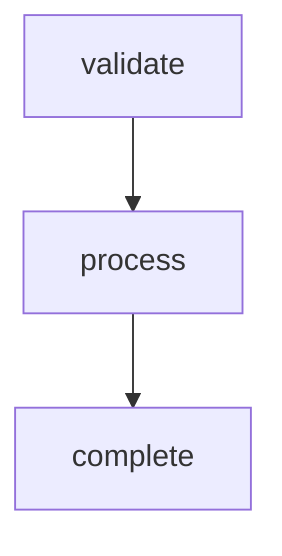
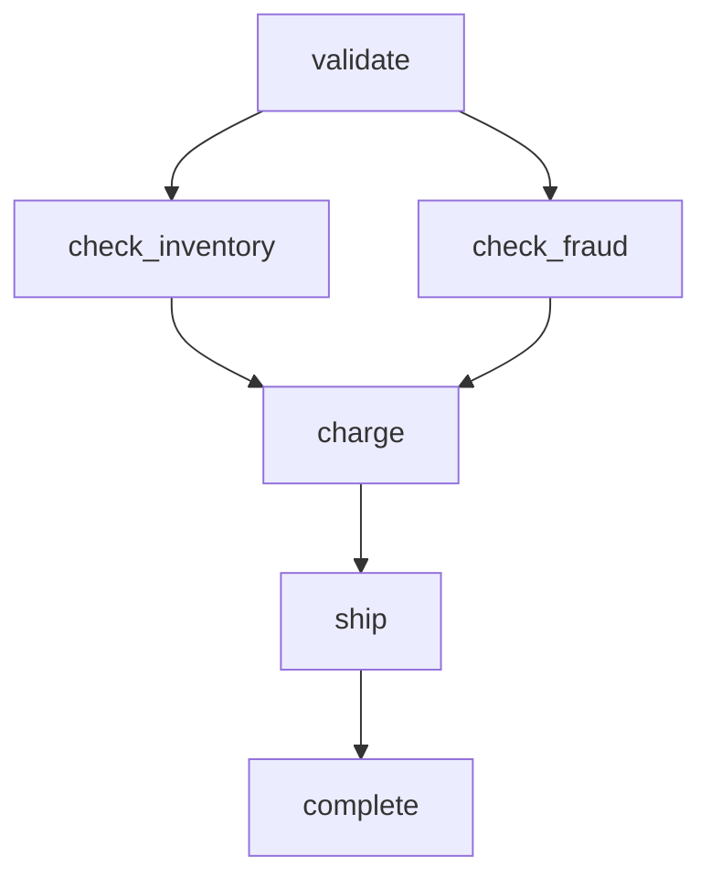
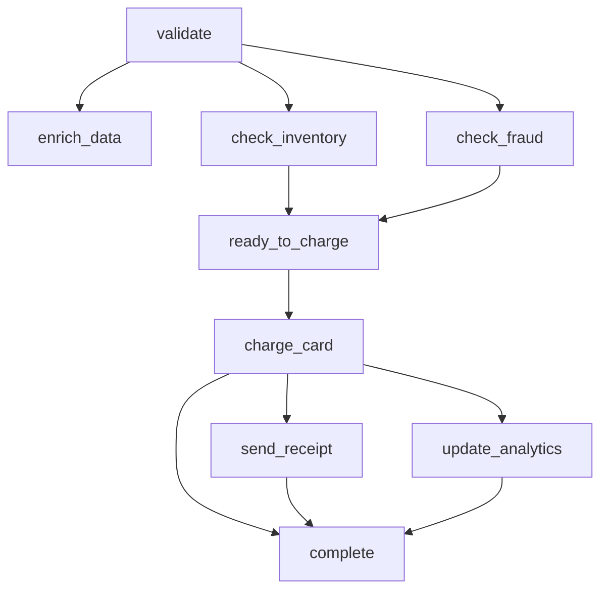
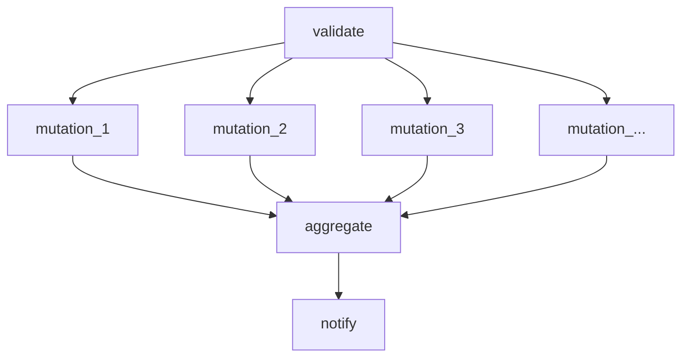
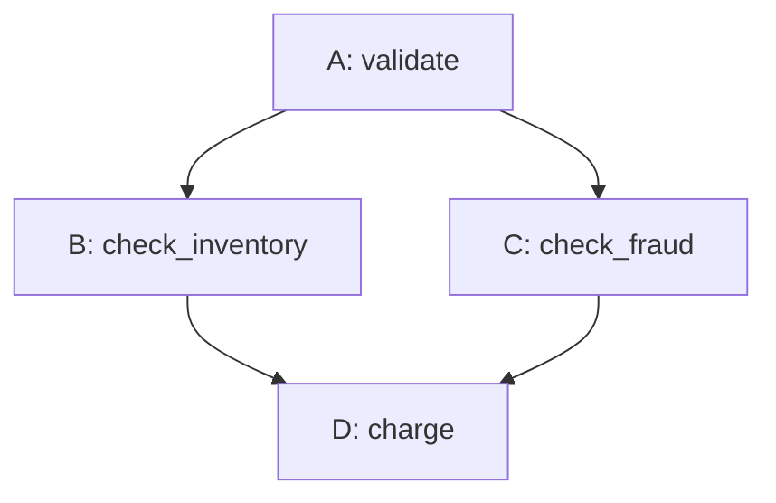

# GenevaDrive DAG Architecture Design Document

This document captures the design deliberation for evolving GenevaDrive from a linear step-based workflow system to a full Directed Acyclic Graph (DAG) execution model, while maintaining backward compatibility and supporting dynamic "just-in-time" workflow definitions.

## Table of Contents

1. [Motivation](#motivation)
2. [Current Architecture](#current-architecture)
3. [DAG Evolution](#dag-evolution)
4. [Step and Task Primitives](#step-and-task-primitives)
5. [The PREVIOUS Token](#the-previous-token)
6. [Unified Namespace Model](#unified-namespace-model)
7. [Dynamic Workflows](#dynamic-workflows)
8. [Serialization Format](#serialization-format)
9. [Node Identity](#node-identity)
10. [Execution State Management](#execution-state-management)
11. [Side Effects Model and Concurrency](#side-effects-model-and-concurrency)
12. [Class-Based vs Dynamic Workflows](#class-based-vs-dynamic-workflows)
13. [Execution Engine](#execution-engine)
14. [Reattempt Semantics](#reattempt-semantics)
15. [DAG Change Detection](#dag-change-detection)
16. [API Reference](#api-reference)
17. [Migration Path](#migration-path)

---

## Motivation

The existing GenevaDrive workflow model assumes a linear sequence of steps. While this covers many use cases, real-world workflows often require:

1. **Parallel execution**: Multiple independent tasks that can run concurrently
2. **Fan-out/fan-in patterns**: One step spawning many parallel tasks, then converging
3. **Complex dependencies**: Tasks that depend on multiple predecessors
4. **Data-driven DAGs**: Workflows where the number of nodes is determined at runtime (e.g., "process 200 ledger mutations in parallel, then notify the user")

The challenge is to introduce DAG capabilities without breaking the existing linear model, which should remain the simple, default case.

---

## Current Architecture

### Existing Model

GenevaDrive workflows currently consist of:

1. **Workflow class**: Defines steps as methods, declares step order
2. **Workflow record**: Persisted instance with context and state
3. **Step executions**: Records tracking completion of each step
4. **Uniqueness constraint**: `(workflow_id, step_name)` ensures each step executes exactly once

```ruby
class OrderWorkflow < GenevaDrive::Workflow
  step :validate
  step :process
  step :complete

  def validate
    # validation logic
  end

  def process
    # processing logic
  end

  def complete
    # completion logic
  end
end
```

### Key Guarantees

- Steps execute in declared order
- Each step runs exactly once per workflow instance
- If the workflow class changes (bug fix, new step added), existing workflows adapt to the new structure
- Step execution records serve as idempotency keys

---

## DAG Evolution

### From Linear to Graph

Steps in a linear workflow are implicitly DAG nodes with each step depending on its predecessor:



A true DAG allows arbitrary dependency relationships:



### Concurrent Execution

With a DAG model, nodes whose dependencies are all satisfied can execute concurrently. In the example above, `check_inventory` and `check_fraud` can run in parallel after `validate` completes.

This is safe because nodes communicate through **side effects** (database writes, file uploads, etc.), not through shared in-memory state. The database handles concurrent access, and independent nodes write to different locations or are idempotent.

**Tradeoff: Concurrent execution complexity**

*Pros:*
- Significant performance improvement for workflows with parallelizable work
- Better resource utilization
- Matches real-world workflow semantics
- No complex locking needed (side effects model eliminates shared mutable state)

*Cons:*
- More complex scheduling logic
- Nodes must "know" where to find upstream side effects by convention
- Harder to reason about execution order for debugging

---

## Step and Task Primitives

The design introduces two primitives for declaring workflow nodes:

### `step` - Chain Member with Positional Dependency

The `step` method declares a node that participates in a linear chain. Its dependency is determined by position in the chain, not by explicit declaration.

```ruby
step :validate     # First in chain, entry point
step :process      # Depends on :validate (previous in chain)
step :complete     # Depends on :process (previous in chain)
```

Steps support insertion via `before_step:` and `after_step:`:

```ruby
step :validate
step :complete
step :audit, after_step: :validate  # Inserts between validate and complete
# Chain becomes: validate → audit → complete
```

### `task` - Explicit DAG Node

The `task` method declares a node with explicit dependencies. Tasks do not participate in the step chain.

```ruby
task :check_inventory, depends_on: :validate
task :check_fraud, depends_on: :validate
task :charge, depends_on: [:check_inventory, :check_fraud]
```

### Relationship Between Step and Task

Both `step` and `task` create nodes in the same DAG. The difference is how dependencies are specified:

- `step`: Dependency is positional (the previous step in the chain), resolved at class load time after all insertions
- `task`: Dependency is explicit and named, specified at declaration

**Tradeoff: Two primitives vs one**

*Pros:*
- The simple case (linear workflow) remains simple with `step`
- Parallel branches are explicit with `task`
- Mental model is clear: "step = main sequence, task = parallel branch"
- Backward compatible with existing `step`-only workflows

*Cons:*
- Two concepts to learn
- Potential confusion about when to use which
- Need to define interaction rules when mixing them

---

## The PREVIOUS Token

### The Problem with Early Binding

If `step :process` hardcodes `depends_on: :validate` at definition time, then inserting a step with `after_step: :validate` breaks the chain:

```ruby
step :validate
step :process      # If this captured depends_on: :validate at definition...
step :audit, after_step: :validate  # ...audit would be orphaned
```

The `process` step would still depend on `validate`, bypassing the inserted `audit` step.

### Late Binding with PREVIOUS

The solution is a magic token representing "whatever comes before me in the chain":

```ruby
module GenevaDrive
  PREVIOUS = Object.new.freeze  # Singleton, not a symbol to avoid collision
end
```

Steps use `depends_on: PREVIOUS` internally, which is resolved after all chain modifications:

```ruby
class Workflow
  def self.step(name, depends_on: PREVIOUS, after_step: nil, before_step: nil)
    @chain.insert(name, after: after_step, before: before_step)
    define_node(name, depends_on: depends_on, chain_member: true)
  end
end
```

### Chain Resolution

At class load time (when the class body finishes evaluating), the chain is resolved:

```ruby
def self.compile_dag!
  # 1. Resolve chain order (handles all insertions)
  chain_order = @chain.to_ordered_list

  # 2. Build predecessor map
  chain_predecessor = {}
  chain_order.each_cons(2) { |pred, succ| chain_predecessor[succ] = pred }

  # 3. Resolve PREVIOUS references
  @nodes.each do |name, node|
    if node[:depends_on] == PREVIOUS
      pred = chain_predecessor[name]
      node[:depends_on] = pred ? [pred] : []
    end
  end
end
```

### PREVIOUS is Never Serialized

An important implementation detail: **PREVIOUS exists only in Ruby memory during class/workflow definition**. It is always resolved to concrete node identifiers before any serialization occurs.

**Class-based workflows:**
1. During class body evaluation, steps store `depends_on: PREVIOUS`
2. At class finalization (`compile_dag!`), PREVIOUS is resolved to concrete step names
3. The compiled DAG contains only string names like `"validate"`, `"process"`
4. No serialization occurs - the DAG structure lives in the class definition

**Dynamic workflows:**
1. The builder tracks the "previous node ID" as nodes are added
2. When a node omits `depends_on:`, the builder immediately substitutes the tracked previous ID
3. By the time `save!` is called, all `depends_on` arrays contain concrete node IDs
4. The serialized JSON contains only strings like `"n_abc123"`

This means we never need to worry about serializing PREVIOUS or choosing a string representation that might collide with node names. The `depends_on` arrays in any stored or serialized format contain only:
- **Node IDs** (e.g., `"n_abc123"`) for dynamic workflows
- **Step names** (e.g., `"validate"`) for class-based internal representation

**Tradeoff: Magic token vs explicit wiring**

*Pros:*
- `before_step:` and `after_step:` work intuitively
- Chain modifications don't require updating other step declarations
- Matches user expectation: "insert between X and Y"

*Cons:*
- Implicit behavior can be surprising
- Debugging requires understanding the resolution process
- The `PREVIOUS` concept needs documentation

---

## Unified Namespace Model

### The Decision: Option B

After considering multiple approaches, the design uses a **unified namespace** where both `step` and `task` create nodes in the same DAG.

### Interaction Rules

1. **Both create DAG nodes**: `step` and `task` are different ways to declare nodes, but all nodes live in the same graph
2. **Mutual references allowed**: A `task` can depend on a `step` by name, and vice versa
3. **Explicit `depends_on:` overrides PREVIOUS**: A step can specify explicit dependencies, breaking from the chain while still being a chain member

```ruby
class OrderWorkflow < GenevaDrive::Workflow
  step :validate
  step :enrich_data

  # Tasks branch off from the chain
  task :check_inventory, depends_on: :validate
  task :check_fraud, depends_on: :validate

  # Step with explicit depends_on - still in chain, but custom dependencies
  step :ready_to_charge, depends_on: [:check_inventory, :check_fraud]

  # Back to implicit chain dependency (PREVIOUS = :ready_to_charge)
  step :charge_card

  # Tasks can depend on steps
  task :send_receipt, depends_on: :charge_card
  task :update_analytics, depends_on: :charge_card

  # Final step with explicit fan-in
  step :complete, depends_on: [:charge_card, :send_receipt, :update_analytics]
end
```

This produces the following DAG:



### The `also_depends_on:` Convenience

For steps that need chain position AND extra dependencies:

```ruby
step :ship_order, also_depends_on: :fraud_final_check
# Equivalent to: depends_on: [PREVIOUS, :fraud_final_check]
# Resolves to:   depends_on: [:charge_card, :fraud_final_check]
```

**Tradeoff: Unified vs separate namespaces**

*Pros:*
- Simpler mental model: one DAG, two declaration styles
- Natural expression of real workflows where parallel branches rejoin the main sequence
- Flexible wiring without artificial boundaries

*Cons:*
- Potential for complex, hard-to-visualize DAGs
- User must understand that steps and tasks share a namespace
- Name collisions between steps and tasks are errors

---

## Dynamic Workflows

### Motivation

Some workflows have structures determined at runtime:

- "Process all 200 pending mutations for this user in parallel"
- "Run validation for each item in the cart"
- "Execute one task per external API endpoint"

These cannot be expressed with a static class definition.

### The "Just-in-Time" Workflow

A dynamic workflow is created at runtime with a DAG defined programmatically:

```ruby
workflow = GenevaDrive::Workflow.new do |w|
  mutations = user.pending_mutations.pluck(:id)

  # Fan-out: create 200 parallel nodes
  mutation_nodes = mutations.map do |id|
    w.node "mutation_#{id}",
      job: ProcessMutationJob,
      args: { mutation_id: id },
      depends_on: nil  # Explicit entry point
  end

  # Fan-in: wait for all mutations
  w.node :aggregate,
    job: AggregateMutationsJob,
    args: { user_id: user.id },
    depends_on: mutation_nodes

  # Continue the chain
  w.node :notify, job: NotifyUserJob, args: { user_id: user.id }
end

workflow.save!
workflow.perform_later
```

### Key Differences from Class-Based Workflows

| Aspect | Class-based | Dynamic |
|--------|-------------|---------|
| DAG source | Class definition | `dag_definition` column |
| Node code | Methods on workflow class | External job classes |
| Persistence | DAG NOT stored (lives in code) | DAG IS stored (frozen at creation) |
| Healing on deploy | Yes - code changes apply automatically | No - DAG is immutable |
| `type` column | STI class name (e.g., `"OrderWorkflow"`) | `nil` |

### Node Handler Model

Dynamic workflows cannot have methods (there's no class), so nodes reference external job classes:

```ruby
class ProcessMutationJob < ApplicationJob
  def perform(mutation_id:, workflow:, node:)
    mutation = Mutation.find(mutation_id)
    mutation.process!
    # Side effect: mutation record is now updated in database
    # No return value needed - downstream nodes know where to find the result
  end
end
```

The execution engine invokes the job class when the node runs. The job produces **side effects** (database updates, file uploads, API calls, etc.) rather than returning data. Downstream nodes know by convention where to find these side effects.

### `depends_on:` Semantics in Dynamic Workflows

```ruby
w.node :a, job: JobA                    # First node, implicitly depends_on: nil
w.node :b, job: JobB                    # Implicitly depends on previous (:a)
w.node :c, job: JobC, depends_on: nil   # Explicit entry point (parallel)
w.node :d, job: JobD, depends_on: :a    # Explicit dependency
w.node :e, job: JobE, depends_on: [:c, :d]  # Multiple dependencies
```

- No `depends_on:` specified → depends on previous node (or nothing if first)
- `depends_on: nil` → explicit entry point, no dependencies
- `depends_on: :name` or `depends_on: [:name1, :name2]` → explicit dependencies

**Tradeoff: Dynamic workflows cannot heal**

*Pros:*
- Full flexibility for data-driven DAGs
- Works for arbitrary numbers of nodes determined at runtime
- Clear separation: the frozen DAG IS the workflow definition

*Cons:*
- Cannot be fixed by code changes
- If a referenced job class is deleted, the workflow fails permanently
- Requires surgical database editing as last resort for recovery
- More fragile than class-based workflows

---

## Serialization Format

### Design Inspiration: Shake and Nuke

The design draws inspiration from professional compositing applications:

- **Apple Shake** (.shk files): Used a C-like scripting language where variable references defined the DAG
- **Foundry Nuke** (.nk files): Uses a stack-based text format with explicit wiring commands

Both share a philosophy: **the document is a recipe that reconstructs the DAG**, human-readable and editable.

### JSON Over YAML

The serialization format is JSON, not YAML:

```json
{
  "version": 1,
  "signature": "a7f3b2c1",
  "frozen_at": "2024-01-15T10:30:00Z",
  "nodes": {
    "n_8f3a2b": {
      "name": "validate",
      "job": "ValidateOrderJob",
      "args": { "order_id": 123 },
      "depends_on": []
    },
    "n_c4d5e6": {
      "name": "check_inventory",
      "job": "CheckInventoryJob",
      "args": {},
      "depends_on": ["n_8f3a2b"]
    }
  }
}
```

Note the absence of a "context" or "state" field - the DAG definition is purely structural. Execution state lives in the `step_executions` table, and nodes communicate through side effects (database writes, file uploads, etc.), not through workflow-level shared state.

**Tradeoff: JSON vs YAML**

*Pros of JSON:*
- Simpler specification, fewer edge cases
- No comments - this is storage, not code
- Universally parseable, no library variations
- Works well with PostgreSQL JSONB

*Cons of JSON:*
- Less human-readable for complex structures
- No anchors/aliases for referencing (unlike YAML)
- Verbose for deeply nested data

The decision: JSON is appropriate because the persisted workflow is **storage**, not **code**. Comments and other YAML features are not needed and could introduce ambiguity.

### No Imperative Code in Serialization

The serialized DAG contains only data. There is no Ruby code, no lambdas, no executable content. This is critical for security and determinism.

The Ruby builder block executes **once at creation time**, then the fully-expanded DAG is frozen as JSON:

```ruby
# At creation time, this Ruby executes:
GenevaDrive::Workflow.new do |w|
  user.pending_mutations.each do |m|
    w.node "mutation_#{m.id}", job: ProcessMutationJob, args: { mutation_id: m.id }
  end
end

# The result is frozen JSON - no loops, no Ruby, fully expanded:
{
  "nodes": {
    "n_abc123": { "name": "mutation_1", "job": "ProcessMutationJob", "args": { "mutation_id": 1 }, ... },
    "n_def456": { "name": "mutation_2", "job": "ProcessMutationJob", "args": { "mutation_id": 2 }, ... },
    // ... 198 more fully expanded nodes
  }
}
```

**Tradeoff: Full expansion vs stored templates**

*Pros of full expansion:*
- No code execution on load
- Completely deterministic
- Safe to store and replay
- Easy to inspect and debug

*Cons of full expansion:*
- Large DAGs produce large JSON documents
- Cannot change node count after creation
- Duplicate structure for similar nodes

---

## Node Identity

### IDs vs Names

Each node has two identifiers:

1. **ID**: Generated at definition time, stable, used for database references (`n_8f3a2b`)
2. **Name**: User-defined, semantic, for display and debugging (`"validate"`)

```json
{
  "nodes": {
    "n_8f3a2b": {
      "name": "validate",
      "job": "ValidateOrderJob",
      "args": { "order_id": 123 },
      "depends_on": []
    },
    "n_c4d5e6": {
      "name": "check_inventory",
      "job": "CheckInventoryJob",
      "args": {},
      "depends_on": ["n_8f3a2b"]
    }
  }
}
```

### Why Both?

- **IDs are stable**: If a user renames a node (e.g., `"validate"` → `"validate_order"`), the `depends_on` references don't break
- **Names are semantic**: Logs, error messages, and UIs show meaningful names
- **IDs are keys**: The `depends_on` array contains IDs, not names

### ID Generation

```ruby
def generate_node_id
  "n_#{SecureRandom.hex(4)}"  # e.g., "n_a1b2c3d4"
end
```

Short, readable, unique within the workflow. The `n_` prefix makes IDs visually distinct from names.

**Tradeoff: Generated IDs vs user-specified IDs**

*Pros of generated IDs:*
- No collision risk
- Renaming nodes is safe
- User doesn't need to think about ID uniqueness

*Cons of generated IDs:*
- IDs are opaque, not meaningful
- Harder to manually edit `depends_on` arrays
- Requires ID ↔ name mapping when debugging

---

## Execution State Management

### Separation of Definition and State

The DAG definition (structure) and execution state are stored separately:

- **DAG definition**: In `dag_definition` column (dynamic) or class definition (class-based)
- **Execution state**: In `step_executions` table

```ruby
# step_executions table
{
  workflow_id: 123,
  node_id: "n_8f3a2b",          # References the DAG node
  state: "completed",            # pending, running, completed, failed
  ancestry_hash: "d4e5f6...",   # Hash of node + completed ancestor executions
  started_at: "2024-01-15T10:30:00Z",
  completed_at: "2024-01-15T10:30:05Z",
  outcome: { ... },              # Execution metadata (not data passing)
  error: nil
}
```

### The `ancestry_hash` Field

Inspired by Nuke's CacheHash concept, the `ancestry_hash` provides a cryptographic proof of execution order:

```ruby
def compute_ancestry_hash(workflow, node_id)
  node = workflow.dag["nodes"][node_id]

  # Get completed ancestor execution hashes (sorted for determinism)
  ancestor_hashes = node["depends_on"].map do |dep_id|
    workflow.step_executions.find_by!(node_id: dep_id).ancestry_hash
  end.sort

  # This node's hash includes its ID + all ancestor hashes
  Digest::SHA256.hexdigest([node_id, *ancestor_hashes].join(":"))
end
```

This creates a chain where each node's hash encapsulates its entire ancestry. Uses:
- **Verification**: Proves this execution happened after specific ancestor executions
- **Debugging**: Trace the exact execution path
- **Idempotency**: Detect if re-running with different ancestors (shouldn't happen, but detectable)

### The `outcome` Field

The `outcome` field (which GenevaDrive already has) stores **execution metadata** - diagnostic information about how the node ran, not data to be passed to other nodes. Examples:
- Timing information
- Resource usage
- Diagnostic messages
- Error details if failed

This is explicitly NOT a data-passing mechanism. Nodes do not read each other's outcomes to get input data.

### Querying State

```ruby
workflow.nodes_with_state
# => [
#   { id: "n_8f3a2b", name: "validate", state: "completed", completed_at: ... },
#   { id: "n_c4d5e6", name: "check_inventory", state: "running", started_at: ... },
#   { id: "n_f7g8h9", name: "check_fraud", state: "pending" },
#   ...
# ]
```

### Idempotency

The `step_executions` uniqueness constraint `(workflow_id, node_id)` ensures each node executes exactly once:

```ruby
execution = workflow.step_executions.create_or_find_by!(node_id: node_id)
return if execution.completed? || execution.running?
```

**Tradeoff: Separate state vs embedded state**

*Pros of separate state:*
- DAG definition remains immutable
- Clear separation of concerns
- Can query execution state independently
- Matches existing GenevaDrive model

*Cons of separate state:*
- Requires joining tables to get full picture
- State and definition can theoretically diverge
- More complex export/import for debugging

---

## Side Effects Model and Concurrency

### The Fundamental Insight

GenevaDrive workflows orchestrate **when** nodes run, not **what data flows between them**.

Nodes produce **side effects**:
- Write to database tables
- Upload files to S3
- Send messages to external APIs
- Update record statuses
- Create new records

Downstream nodes **know by convention** where to find these side effects. The workflow doesn't pass data between nodes - it just ensures ordering.

```ruby
# Node A: validates order, updates database
def validate_order
  order = Order.find(workflow.order_id)
  order.update!(status: "validated", validated_at: Time.current)
  # Side effect: order record now has status "validated"
end

# Node B: doesn't receive data from A, just knows where to look
def check_inventory
  order = Order.find(workflow.order_id)
  # Knows the order exists and is validated because A completed first
  order.line_items.each do |item|
    # Check inventory for each item
  end
end
```

### Why This Matters for Concurrency

The original GenevaDrive had a constraint: **at most one step executing at a time per workflow**. This protected against race conditions on shared in-memory state.

With the side effects model, there is no shared in-memory state. Each node:
1. Reads from persistent storage (database, files, APIs)
2. Does its work
3. Writes to persistent storage

Two independent nodes can run concurrently because:
- They don't share VM memory
- They write to different locations (or are idempotent)
- The database handles concurrent access

### Concurrency Rules

1. **Each node executes exactly once**: `(workflow_id, node_id)` uniqueness constraint
2. **A node starts when all dependencies complete**: DAG semantics
3. **Independent nodes run concurrently**: No artificial serialization
4. **No shared mutable state**: Side effects are in persistent storage

```ruby
def schedule_ready_nodes(workflow)
  dag = workflow.dag
  completed = workflow.step_executions.completed.pluck(:node_id).to_set
  running = workflow.step_executions.running.pluck(:node_id).to_set

  dag["nodes"].each do |node_id, node|
    next if completed.include?(node_id)
    next if running.include?(node_id)

    # Can run if all dependencies completed
    dependencies_met = node["depends_on"].all? { |dep| completed.include?(dep) }

    if dependencies_met
      # Schedule it - multiple nodes can be scheduled concurrently
      WorkflowNodeJob.perform_later(workflow_id: workflow.id, node_id: node_id)
    end
  end
end
```

### Example: Parallel Processing



```ruby
# Fan-out: 200 mutations, all independent
mutation_ids.each do |id|
  w.node "mutation_#{id}",
    job: ProcessMutationJob,
    args: { mutation_id: id },
    depends_on: :validate
end

# Each ProcessMutationJob:
class ProcessMutationJob < ApplicationJob
  def perform(mutation_id:, workflow:, node:)
    mutation = Mutation.find(mutation_id)
    mutation.process!
    # Side effect: this specific mutation record is now processed
    # Other mutations are independent - no shared state
  end
end

# Fan-in: aggregate knows to query all processed mutations
w.node :aggregate, job: AggregateMutationsJob, depends_on: mutation_node_ids

class AggregateMutationsJob < ApplicationJob
  def perform(workflow:, node:)
    # Query database for all mutations that were processed
    processed = Mutation.where(workflow_id: workflow.id, status: "processed")
    # Aggregate them
  end
end
```

The 200 mutation jobs can run concurrently. They don't need to "pass" their results to the aggregate job - the aggregate job knows to query the database.

**Tradeoff: Side effects vs data passing**

*Pros of side effects model:*
- No shared mutable state = no race conditions
- Natural concurrency without complex locking
- Matches how real systems work (databases, file systems, APIs)
- Simpler execution engine
- Nodes are independently testable

*Cons of side effects model:*
- Nodes must "know" where to find upstream results by convention
- No compile-time checking of data flow
- Harder to visualize data dependencies (only control flow is explicit)
- Requires careful design of storage locations

---

## Class-Based vs Dynamic Workflows

### Fundamental Difference

This is the most important architectural distinction:

**Class-based workflows** are resilient to code changes:
- The DAG lives in the class definition, not the database
- Fix a bug → redeploy → existing workflows use the fixed code
- Add a new step → existing workflows pick it up naturally
- The workflow record just says "I am an OrderWorkflow" via STI

**Dynamic workflows** are frozen at creation:
- The DAG lives in the database, fully serialized
- Code changes have no effect on existing workflows
- If a job class is deleted, the workflow fails with a clear error
- Last resort: surgical editing of `dag_definition` in the database

### Storage Strategy

```ruby
# Class-based workflow record
{
  id: 123,
  type: "OrderWorkflow",        # STI points to the class
  dag_definition: nil,          # NOT stored - comes from class
  state: "running"
  # Application-specific columns (order_id, user_id, etc.) are on the model
}

# Dynamic workflow record
{
  id: 124,
  type: nil,                    # No class
  dag_definition: { ... },      # Fully serialized DAG
  state: "running"
}
```

Note the absence of a shared "context" hash. Workflow-specific data (like `order_id`) should be columns on the workflow model or accessible through associations. Nodes access this data through the workflow instance, not through a generic context bag.

### Which to Use When

| Use Case | Recommendation |
|----------|----------------|
| Standard business process (order fulfillment) | Class-based |
| Workflow that needs bug fixes to apply to running instances | Class-based |
| Data-driven parallelism (process N items) | Dynamic |
| One-off migration or batch job | Dynamic |
| Workflow structure known at design time | Class-based |
| Workflow structure determined by runtime data | Dynamic |

**Tradeoff: Flexibility vs resilience**

*Class-based pros:*
- Self-healing on deploy
- Single source of truth (the code)
- Easier to reason about
- Standard Rails patterns (STI, methods)

*Class-based cons:*
- Cannot handle data-driven node counts
- DAG structure must be known at design time

*Dynamic pros:*
- Arbitrary DAG structures at runtime
- Can process variable amounts of data in parallel
- Full flexibility

*Dynamic cons:*
- Cannot be fixed by code changes
- Frozen at creation
- More fragile, requires careful job class management

---

## Execution Engine

### DAG Resolution

The execution engine uses a simple rule: **stored DAG takes precedence, otherwise use class**.

```ruby
class GenevaDrive::Workflow < ApplicationRecord
  def dag
    # If dag_definition column has data, use it (dynamic workflow)
    # Otherwise, get DAG from class definition (class-based workflow)
    dag_definition.presence || self.class.compiled_dag
  end
end
```

That's it. No special flags, no type checking, no "unified interface". The presence or absence of `dag_definition` is the determining factor.

This means:
- Class-based workflow: `dag_definition` is NULL, DAG comes from `self.class.compiled_dag`
- Dynamic workflow: `dag_definition` has the frozen JSON, that's what gets used

A class-based workflow could theoretically have its `dag_definition` populated later (for debugging, freezing a snapshot, etc.), and from that point on the stored version would be used. This is intentional - the column is the source of truth when present.

### Node Execution

The executor looks at the node definition to determine how to run it:
- If node has a `"job"` key → instantiate that job class
- Otherwise → call the method on the workflow instance

For first execution, a new step_execution is created with `attempt_number: 1`. Reattempts use the dedicated `reattempt!` method (see Reattempt Semantics section).

```ruby
class GenevaDrive::NodeExecutor
  def execute(workflow, node_id, attempt_number: nil)
    node = workflow.dag["nodes"][node_id]

    # Determine which attempt we're executing
    if attempt_number
      # Specific attempt requested (e.g., from job queue)
      execution = workflow.step_executions.find_by!(
        node_id: node_id,
        attempt_number: attempt_number
      )
      return if execution.completed? || execution.running?
    else
      # First execution - create attempt 1
      execution = workflow.step_executions.create_with(
        attempt_number: 1,
        state: "pending"
      ).find_or_create_by!(node_id: node_id, attempt_number: 1)

      # If already completed or running, nothing to do
      return if execution.completed? || execution.running?
    end

    # Compute ancestry hash before starting
    ancestry_hash = compute_ancestry_hash(workflow, node_id)

    execution.update!(
      state: "running",
      started_at: Time.current,
      ancestry_hash: ancestry_hash
    )

    begin
      # Node tells us how to execute it - produces side effects, not return values
      if node["job"].present?
        execute_job_class(workflow, node)
      else
        execute_workflow_method(workflow, node)
      end

      execution.update!(
        state: "completed",
        completed_at: Time.current
      )

      schedule_unblocked_nodes(workflow, node_id)

    rescue => e
      execution.update!(
        state: "failed",
        completed_at: Time.current,
        error: { class: e.class.name, message: e.message }
      )

      handle_failure(workflow, node_id, e)
    end
  end

  private

  def execute_workflow_method(workflow, node)
    method_name = node["method"] || node["name"]
    workflow.send(method_name)
    # Return value is ignored - side effects are what matter
  end

  def execute_job_class(workflow, node)
    job_class = node["job"].constantize
    job_class.perform_now(
      **node["args"].symbolize_keys,
      workflow: workflow,
      node: node
    )
    # Return value is ignored - side effects are what matter
  end
end
```

This means a class-based workflow could theoretically mix methods and job classes if desired - the node definition is the authority, not the workflow type. Note that return values are ignored - nodes communicate through side effects.

### Scheduling Unblocked Nodes

When a node completes, the engine checks which dependent nodes are now unblocked:

```ruby
def schedule_unblocked_nodes(workflow, completed_node_id)
  dag = workflow.dag

  # A node is "completed" if ANY attempt succeeded (regardless of prior failures)
  completed_nodes = workflow.step_executions
    .where(state: "completed")
    .distinct
    .pluck(:node_id)
    .to_set

  dag["nodes"].each do |node_id, node|
    next if completed_nodes.include?(node_id)
    next if workflow.step_executions.exists?(node_id: node_id, state: "running")

    # Check if all dependencies are satisfied
    dependencies_satisfied = node["depends_on"].all? do |dep_id|
      completed_nodes.include?(dep_id)
    end

    if dependencies_satisfied
      WorkflowNodeJob.perform_later(workflow_id: workflow.id, node_id: node_id)
    end
  end
end
```

### Error Handling for Dynamic Workflows

```ruby
def execute_job_class(workflow, node)
  job_class = node["job"].safe_constantize

  if job_class.nil?
    raise GenevaDrive::MissingJobClass, <<~ERROR
      Dynamic workflow #{workflow.id} references job class "#{node["job"]}"
      which no longer exists.

      Node: #{node["name"]} (#{node_id})
      Frozen at: #{workflow.dag_definition["frozen_at"]}

      Dynamic workflows cannot be healed by code changes.

      Options:
      1. Restore the #{node["job"]} class
      2. Cancel this workflow and create a new one
      3. Surgically edit dag_definition (last resort)
    ERROR
  end

  job_class.perform_now(**node["args"].symbolize_keys, workflow: workflow, node: node)
end
```

---

## Reattempt Semantics

When a node fails, it may need to be reattempted. This section describes the database rows created, locking semantics, and how downstream nodes behave during reattempts.

### Database Schema for Attempts

Each node execution creates a `step_execution` row. Reattempts create additional rows with an incrementing `attempt_number`:

```ruby
# step_executions table schema
create_table :step_executions do |t|
  t.references :workflow, null: false
  t.string :node_id, null: false
  t.integer :attempt_number, null: false, default: 1
  t.string :state, null: false, default: "pending"
  t.string :ancestry_hash
  t.jsonb :error
  t.datetime :started_at
  t.datetime :completed_at
  t.timestamps
end

# Uniqueness is per attempt, not per node
add_index :step_executions,
          [:workflow_id, :node_id, :attempt_number],
          unique: true,
          name: "idx_step_executions_unique_attempt"

# Fast lookup of completed executions
add_index :step_executions,
          [:workflow_id, :node_id, :state],
          name: "idx_step_executions_by_state"
```

### Reattempt Lifecycle: Database Rows

Consider a node A that fails on first attempt:

```
Initial state: no step_execution rows

┌─────────────────────────────────────────────────────────────────────┐
│ A starts (attempt 1)                                                │
├─────────────────────────────────────────────────────────────────────┤
│ INSERT step_executions:                                             │
│   workflow_id=1, node_id="A", attempt_number=1, state="running"     │
└─────────────────────────────────────────────────────────────────────┘

┌─────────────────────────────────────────────────────────────────────┐
│ A fails (attempt 1)                                                 │
├─────────────────────────────────────────────────────────────────────┤
│ UPDATE step_executions SET state="failed", error={...}              │
│   WHERE workflow_id=1 AND node_id="A" AND attempt_number=1          │
└─────────────────────────────────────────────────────────────────────┘

┌─────────────────────────────────────────────────────────────────────┐
│ A reattempted (attempt 2)                                           │
├─────────────────────────────────────────────────────────────────────┤
│ INSERT step_executions:                                             │
│   workflow_id=1, node_id="A", attempt_number=2, state="running"     │
│                                                                     │
│ Now we have TWO rows for node A:                                    │
│   attempt=1: failed                                                 │
│   attempt=2: running                                                │
└─────────────────────────────────────────────────────────────────────┘

┌─────────────────────────────────────────────────────────────────────┐
│ A succeeds (attempt 2)                                              │
├─────────────────────────────────────────────────────────────────────┤
│ UPDATE step_executions SET state="completed", ancestry_hash="..."   │
│   WHERE workflow_id=1 AND node_id="A" AND attempt_number=2          │
│                                                                     │
│ Final state - TWO rows:                                             │
│   attempt=1: failed                                                 │
│   attempt=2: completed                                              │
└─────────────────────────────────────────────────────────────────────┘
```

### Locking Semantics

Three scenarios require locking:

**1. Preventing duplicate execution of the same attempt:**

```ruby
def execute_node(workflow, node_id, attempt_number)
  # Advisory lock on specific attempt
  lock_key = "geneva:#{workflow.id}:#{node_id}:#{attempt_number}"

  workflow.with_advisory_lock(lock_key) do
    execution = workflow.step_executions.find_by!(
      node_id: node_id,
      attempt_number: attempt_number
    )

    # Double-check state inside lock
    return if execution.completed? || execution.running?

    # Proceed with execution...
  end
end
```

**2. Preventing concurrent reattempts:**

Only one reattempt can be created at a time. We use SELECT FOR UPDATE on the latest attempt:

```ruby
def create_reattempt(workflow, node_id)
  workflow.with_lock do  # Workflow-level lock for simplicity
    latest = workflow.step_executions
      .where(node_id: node_id)
      .order(attempt_number: :desc)
      .lock("FOR UPDATE")
      .first

    # Can only reattempt if latest attempt is in a retryable state
    unless latest&.retryable?
      raise "Cannot reattempt: latest attempt is #{latest&.state || 'missing'}"
    end

    # Create new attempt
    workflow.step_executions.create!(
      node_id: node_id,
      attempt_number: latest.attempt_number + 1,
      state: "running",
      started_at: Time.current
    )
  end
end
```

**3. Preventing reattempt while still running:**

The lock in scenario 2 combined with state checking prevents this. A running attempt is not `retryable?`:

```ruby
class StepExecution < ApplicationRecord
  def retryable?
    state.in?(%w[failed timed_out cancelled])
  end
end
```

### Downstream Nodes: Which Execution Do They Use?

When a downstream node starts, it must determine which parent executions to use for its ancestry hash. The rule is simple: **use the latest completed execution of each parent**.

```ruby
def compute_ancestry_hash(workflow, node_id)
  node = workflow.dag["nodes"][node_id]

  parent_hashes = node["depends_on"].map do |parent_id|
    # Get the LATEST COMPLETED execution for each parent
    parent_execution = workflow.step_executions
      .where(node_id: parent_id, state: "completed")
      .order(attempt_number: :desc)
      .first!

    parent_execution.ancestry_hash
  end

  # Hash this node's ID with all parent hashes
  Digest::SHA256.hexdigest([node_id, *parent_hashes.sort].join(":"))
end
```

### Diamond Dependencies with Reattempts

Consider a diamond DAG where one path fails:



Scenario:
1. A completes (attempt 1)
2. B completes (using A's hash)
3. C fails (attempt 1)
4. D is blocked (waiting for C)
5. C reattempts and completes (attempt 2)
6. D can now run

**What ancestry hash does D get?**

D computes its hash using:
- B's completed execution (which references A attempt 1)
- C's latest completed execution (attempt 2, which also references A attempt 1)

```
D.ancestry_hash = SHA256(
  "D" :
  B.ancestry_hash :    # = SHA256("B" : A.attempt_1.ancestry_hash)
  C.ancestry_hash      # = SHA256("C" : A.attempt_1.ancestry_hash)  ← attempt 2!
)
```

The ancestry hash chain proves: D ran after B completed and after C's **second** attempt completed.

### What If A Is Reattempted After B Completed?

This is a more complex scenario:

1. A completes (attempt 1)
2. B completes (using A attempt 1's hash)
3. C fails (attempt 1)
4. **A is reattempted** for some reason (attempt 2)
5. A completes (attempt 2)
6. C reattempts (attempt 2)
7. D runs

Now we have a problem: B used A attempt 1's hash, but C attempt 2 uses A attempt 2's hash. D's ancestry will show an inconsistent DAG execution!

**Policy decision: Do we allow reattempting a node whose dependents have already completed?**

There are two options:

**Option 1: Disallow (strict)**
```ruby
def create_reattempt(workflow, node_id)
  # Check if any downstream nodes have completed
  downstream = find_all_downstream_nodes(workflow.dag, node_id)
  downstream_completed = workflow.step_executions
    .where(node_id: downstream, state: "completed")
    .exists?

  if downstream_completed
    raise "Cannot reattempt #{node_id}: downstream nodes have already completed"
  end

  # Proceed with reattempt...
end
```

**Option 2: Cascade invalidation (complex)**
When reattempting a node, mark all downstream completed executions as invalidated and require re-execution. This is powerful but complex and potentially expensive.

**Recommendation: Option 1 (strict)** for simplicity. If you need to re-run a subtree, create a new workflow or use a purpose-built "partial replay" feature.

### Reattempt API

```ruby
# Reattempt a specific node
workflow.reattempt!(:check_fraud)

# Automatic retry with exponential backoff (configured per node)
class OrderWorkflow < GenevaDrive::Workflow
  step :validate
  task :check_fraud, depends_on: [:validate], retry: { max: 3, backoff: :exponential }
  step :complete, depends_on: [:check_fraud]
end
```

### Execution History

The multiple attempt rows provide a complete execution history:

```ruby
workflow.step_executions.where(node_id: "check_fraud").order(:attempt_number)
# => [
#   #<StepExecution attempt=1 state="failed" error={class: "TimeoutError", ...}>,
#   #<StepExecution attempt=2 state="failed" error={class: "RateLimitError", ...}>,
#   #<StepExecution attempt=3 state="completed" ancestry_hash="abc123...">
# ]
```

This history is valuable for debugging, audit trails, and understanding failure patterns.

---

## DAG Change Detection

### For Class-Based Workflows

Class-based workflows are designed to adapt to changes. However, some changes can cause issues:

- Removing a step that has already executed
- Changing dependencies such that completed steps would need to re-run
- Creating cycles

### DAG Signature

A signature captures the DAG structure for change detection:

```ruby
def self.dag_signature
  Digest::SHA256.hexdigest(
    @nodes.map { |name, n| [name, n[:depends_on].sort] }.sort.to_json
  )
end
```

### Validation on Execution

```ruby
def validate_dag_compatibility!
  # Only relevant when DAG comes from class (not stored)
  return if dag_definition.present?

  current_dag = self.class.compiled_dag
  completed_node_ids = step_executions.completed.pluck(:node_id)

  # Check: all completed nodes still exist
  completed_node_ids.each do |node_id|
    unless current_dag["nodes"].key?(node_id)
      raise DagConfigurationError, "Completed node #{node_id} no longer exists in DAG"
    end
  end

  # Check: dependencies of pending nodes are satisfiable
  # ... additional validation
end
```

### For Dynamic Workflows

Dynamic workflows don't change - the stored `dag_definition` is immutable. The signature is computed once at creation and stored for reference.

**Tradeoff: Strict validation vs permissive healing**

*Pros of strict validation:*
- Clear failure modes
- No silent data corruption
- Easier to reason about

*Cons of strict validation:*
- Some "safe" changes are rejected
- Requires manual intervention for stuck workflows

*Recommended approach:* Warn but allow for class-based (healing is the feature), fail hard for dynamic (immutability is the feature).

---

## API Reference

### Class-Based Workflow Definition

```ruby
class OrderWorkflow < GenevaDrive::Workflow
  # Linear chain with implicit dependencies
  step :validate
  step :enrich

  # Chain insertion
  step :audit, after_step: :validate

  # Explicit DAG nodes
  task :check_inventory, depends_on: :enrich
  task :check_fraud, depends_on: :enrich

  # Fan-in back to chain
  step :charge, depends_on: [:check_inventory, :check_fraud]

  # Step with additional dependencies
  step :ship, also_depends_on: :external_validation

  # Methods define node logic
  def validate; ...; end
  def enrich; ...; end
  def audit; ...; end
  def check_inventory; ...; end
  def check_fraud; ...; end
  def charge; ...; end
  def ship; ...; end
end

# Usage
OrderWorkflow.create!(order_id: 123).perform_later
```

### Dynamic Workflow Definition

```ruby
workflow = GenevaDrive::Workflow.new do |w|
  # Explicit entry point
  w.node :start, job: StartJob, args: { user_id: user.id }, depends_on: nil

  # Implicit dependency on previous
  w.node :validate, job: ValidateJob

  # Fan-out
  items.each do |item|
    w.node "process_#{item.id}",
      job: ProcessItemJob,
      args: { item_id: item.id },
      depends_on: :validate
  end

  # Fan-in
  w.node :aggregate,
    job: AggregateJob,
    depends_on: items.map { |i| "process_#{i.id}" }

  # Continue chain
  w.node :notify, job: NotifyJob
end

workflow.save!
workflow.perform_later
```

### Fan-Out Helper

```ruby
workflow = GenevaDrive::Workflow.new do |w|
  # Returns array of node IDs for use in depends_on
  item_nodes = w.fan_out items,
    name: ->(item) { "process_#{item.id}" },
    job: ProcessItemJob,
    args: ->(item) { { item_id: item.id } }

  w.node :aggregate, job: AggregateJob, depends_on: item_nodes
end
```

### Querying Workflow State

```ruby
workflow.dag                    # The DAG structure (stored takes precedence, else from class)
workflow.dag_definition         # The stored DAG (nil for class-based)

workflow.nodes_with_state       # DAG + execution state merged
workflow.step_executions        # Raw execution records

workflow.export_dag             # JSON string for inspection/editing
workflow.import_dag!(json)      # Surgical repair (last resort)
```

---

## Migration Path

### Phase 1: Internal Refactoring

- Refactor internal step representation to use DAG structures
- Existing `step`-only workflows continue to work unchanged
- No new public API yet

### Phase 2: Task Primitive

- Introduce `task` method for explicit DAG nodes
- Allow mixing `step` and `task` in class-based workflows
- Update execution engine to handle concurrent nodes

### Phase 3: Dynamic Workflows

- Add `dag_definition` column to workflows table
- Implement builder API for dynamic workflows
- Implement external job class handler

### Phase 4: Fan-Out Helpers

- Add `fan_out` convenience method
- Optimize scheduling for large node counts
- Add monitoring/visualization for complex DAGs

### Database Migrations

```ruby
class AddDagSupport < ActiveRecord::Migration[7.0]
  def change
    add_column :workflows, :dag_definition, :jsonb

    add_column :step_executions, :node_id, :string
    add_column :step_executions, :attempt_number, :integer, null: false, default: 1
    add_column :step_executions, :ancestry_hash, :string
    add_column :step_executions, :error, :jsonb

    # Uniqueness is per attempt, not per node (enables reattempts)
    add_index :step_executions,
              [:workflow_id, :node_id, :attempt_number],
              unique: true,
              name: "idx_step_executions_unique_attempt"

    # Fast lookup for scheduling and state queries
    add_index :step_executions,
              [:workflow_id, :node_id, :state],
              name: "idx_step_executions_by_state"

    add_index :step_executions, :ancestry_hash
  end
end
```

Note: We don't add a `result` column - nodes communicate through side effects, not through stored return values. The existing `outcome` column (if present) is for execution metadata, not data passing.

---

## Open Questions

1. **Maximum DAG size**: What are the practical limits for node count? JSON size? Scheduling overhead?

2. **Visualization**: How to represent complex DAGs in logs, error messages, admin UIs?

3. ~~**Partial retry**: Can we retry a subtree of a failed DAG without re-running completed nodes?~~ **Resolved**: See "Reattempt Semantics" section. Individual nodes can be reattempted via `workflow.reattempt!(:node_name)`. Downstream nodes automatically become eligible once a reattempted node completes. Reattempting a node whose downstream nodes have already completed is disallowed (strict policy).

4. **Cross-workflow dependencies**: Should workflows be able to depend on other workflows?

5. **Dynamic workflow templates**: Can we have parameterized "templates" that expand at creation time but share job class definitions?

---

## Conclusion

This design extends GenevaDrive from linear step sequences to full DAG execution while maintaining the simplicity of the common case. The key principles are:

1. **Linear workflows remain simple**: `step` continues to work exactly as before
2. **Parallel execution is opt-in**: Use `task` to branch off the main sequence
3. **Stored DAG takes precedence**: If `dag_definition` column has data, use it; otherwise get DAG from class. No special flags or type checking needed.
4. **Class-based workflows heal**: Code changes apply to running workflows (when DAG comes from class)
5. **Dynamic workflows freeze**: The DAG is immutable after creation, with clear failure modes
6. **Node defines its execution**: If node has `"job"` key, use job class; otherwise call workflow method. This is orthogonal to where the DAG comes from.
7. **Side effects, not data passing**: Nodes produce side effects (database writes, file uploads, etc.) and downstream nodes know by convention where to find them. No shared mutable state, no context passing.
8. **Natural concurrency**: Because there's no shared in-memory state, independent nodes can run concurrently without additional locking or serialization constraints.
9. **Ancestry tracking**: The `ancestry_hash` (inspired by Nuke's CacheHash) provides a cryptographic chain proving execution order.

The tradeoffs are intentional: we accept the complexity of two declaration styles (`step` and `task`) to keep the simple case simple. We accept the fragility of dynamic workflows to gain runtime flexibility. We accept the PREVIOUS token's implicit behavior to support chain insertion. We accept that nodes must "know" where to find upstream side effects by convention in exchange for simple, natural concurrency.
