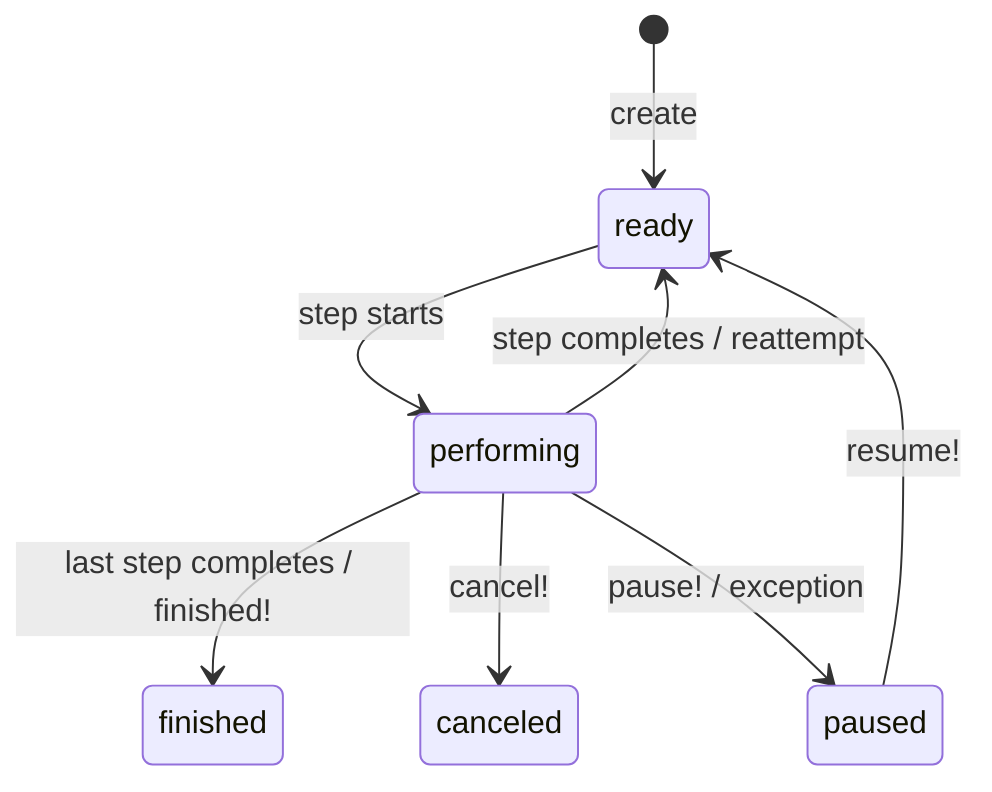

# GenevaDrive Manual Outline

## 1. Introduction

Brief statement of what GenevaDrive solves: durable, multi-step workflows in Rails. A paragraph about the fact that `async perfrormFunc` as "durable function" is a failed concept because the graph of steps and the code of the step should live in separate universes. Geneva drive delivers on that architecture.

### 1.1 The Problem with Long-Running Processes

- Web requests are ephemeral
- Background jobs lack state continuity
- Multi-step processes need coordination
- Idempotency is hard to get right
- ActiveJob does not provide a stable ID - retried ActiveJobs can create duplicate IDs even though jobs are distinct

### 1.2 What GenevaDrive Provides

Bullet list of guarantees:
- One execution at a time per workflow
- Steps are explicitly idempotent via step executions
- Full visibility into workflow state
- Database-backed durability

---

## 2. Core Concepts

### 2.1 Workflows

A Workflow is an ActiveRecord model representing a durable process.

**Example: `SubscriptionRenewalWorkflow` - basic workflow with three steps**
```ruby
class SubscriptionRenewalWorkflow < GenevaDrive::Workflow
  step :send_renewal_notice do ...
  step :charge_payment, wait: 3.days do ...
  step :activate_new_period do ...
end
```

### 2.2 Steps

Steps are units of work executed sequentially.

**Example: `DocumentProcessingWorkflow` - steps with wait times**
```ruby
step :extract_text do ...
step :analyze_content, wait: 5.minutes do ...
step :generate_summary, wait: 10.minutes do ...
```

### 2.3 The Hero

The hero is the record the workflow operates on.

**Example: Creating a workflow for a `Payment` hero**
```ruby
PaymentWorkflow.create!(hero: payment)
```

**Example: Accessing hero within steps**
```ruby
step :process do
  hero.mark_processing!
end
```

### 2.4 Step Executions

Step executions are the idempotency mechanism. Each attempt to run a step creates a StepExecution record.

Explain:
- One StepExecution per attempt
- Serves as audit trail
- Prevents duplicate execution
- Records timing, outcome, errors

**Example: Querying step execution history**
```ruby
workflow.execution_history.each do |exec|
  puts "#{exec.step_name}: #{exec.state} (#{exec.outcome})"
end
```

---

## 3. Defining Steps

### 3.1 Named Steps

**Example: `AccountVerificationWorkflow` - explicitly named steps**
```ruby
step :verify_email do ...
step :verify_phone do ...
step :verify_identity do ...
```

### 3.2 Anonymous Steps

When step names don't matter (polling, retries).

**Example: `StatusPollingWorkflow` - anonymous steps with increasing intervals**
```ruby
step { check_status! }
step(wait: 1.minute) { check_status! }
step(wait: 5.minutes) { check_status! }
```

### 3.3 Instance Methods as Steps

**Example: `DataExportWorkflow` - using `step def` pattern**
```ruby
step def gather_records
  @records = hero.exportable_records
end

step def write_to_storage
  Storage.write(hero.export_path, @records)
end
```

### 3.4 Step Ordering with `before_step:` and `after_step:`

**Example: `ComplianceWorkflow` - inserting steps relative to others**
```ruby
step :collect_data do ...
step :submit_report do ...
step :audit_check, before_step: :submit_report do ...
```

---

## 4. Flow Control

### 4.1 Overview

The five flow control methods: `cancel!`, `pause!`, `reattempt!`, `skip!`, `finished!`

Explain throw/catch mechanism briefly.

### 4.2 Canceling a Workflow

**Example: `TrialConversionWorkflow` - cancel when user converts early**
```ruby
step :send_trial_reminder, wait: 7.days do
  cancel! if hero.converted_to_paid?
  TrialMailer.reminder(hero).deliver_later
end
```

### 4.3 Pausing for Manual Intervention

**Example: `FraudReviewWorkflow` - pause for human review**
```ruby
step :automated_check do
  if hero.risk_score > 80
    hero.flag_for_review!
    pause!
  end
end
```

Explain: resuming with `workflow.resume!`

### 4.4 Reattempting Steps

**Example: `ExternalApiWorkflow` - retry with backoff**
```ruby
step :sync_to_crm do
  result = CrmApi.sync(hero)
  reattempt!(wait: result.retry_after) if result.rate_limited?
end
```

### 4.5 Skipping Steps

**Example: `OnboardingWorkflow` - skip optional steps**
```ruby
step :request_phone_verification do
  skip! if hero.phone_verified?
  SmsService.send_code(hero)
end
```

### 4.6 Early Completion

**Example: `OrderFulfillmentWorkflow` - finish early when goal achieved**
```ruby
step :check_delivery_status do
  if hero.delivered?
    hero.complete!
    finished!
  end
  reattempt!(wait: 1.hour)
end
```

---

## 5. Workflow States

### 5.1 State Machine Diagram



### 5.2 Step Execution States

Separate state machine for step executions:
- scheduled
- in_progress
- completed
- failed
- canceled
- skipped

---

## 6. Conditional Execution

### 6.1 Skipping Steps with `skip_if:`

**Example: `NotificationWorkflow` - skip based on preferences**
```ruby
step :send_email, skip_if: -> { hero.email_unsubscribed? } do
  NotificationMailer.notify(hero).deliver_later
end

step :send_sms, skip_if: :sms_disabled? do
  SmsService.notify(hero)
end
```

### 6.2 Blanket Cancellation with `cancel_if`

**Example: `EngagementWorkflow` - cancel if hero becomes inactive**
```ruby
class EngagementWorkflow < GenevaDrive::Workflow
  cancel_if { hero.deactivated? }
  cancel_if { hero.unsubscribed? }

  step :send_week_1_email do ...
  step :send_week_2_email, wait: 7.days do ...
end
```

---

## 7. The Asynchronous Execution Model

### 7.1 Key Assumptions

Bullet list:
- Every step runs on a different machine/process/thread
- Instance variables don't persist between steps
- The workflow is always loaded fresh from database
- Steps may be separated by seconds or months

### 7.2 No Shared State Between Steps

> [!WARNING] callout about instance variables not persisting

**Example: Wrong way vs right way to share data**
```ruby
# WRONG - @data won't exist in next step
step :fetch do
  @data = ExternalApi.fetch(hero)
end

# RIGHT - persist to database
step :fetch do
  hero.update!(external_data: ExternalApi.fetch(hero))
end
```

---

## 8. Exception Handling

### 8.1 Default Behavior

By default, unhandled exceptions pause the workflow.

### 8.2 Configuring Exception Policy

**Example: `ResilientApiWorkflow` - reattempt on exception**
```ruby
step :call_external_api, on_exception: :reattempt! do
  ExternalApi.call(hero)
end
```

### 8.3 Manual Exception Handling

**Example: `PaymentWorkflow` - granular error handling**
```ruby
step def initiate_payment
  PaymentGateway.charge(hero)
rescue PaymentGateway::RateLimited => e
  reattempt!(wait: e.retry_after)
rescue PaymentGateway::CardDeclined
  hero.notify_card_declined!
  cancel!
rescue PaymentGateway::ServiceDown
  pause!  # Wait for manual intervention
end
```

### 8.4 Recovering Paused Workflows

**Example: Console commands to find and resume**
```ruby
GenevaDrive::Workflow.paused.each do |workflow|
  puts "#{workflow.class.name} ##{workflow.id}: #{workflow.next_step_name}"
end

workflow.resume!
```

---

## 9. Working with Heroes

### 9.1 Choosing the Right Hero

Guidance: make the hero the business object being processed, not always the user.

**Example: `InvoiceWorkflow` with `Invoice` as hero (not `User`)**
```ruby
invoice = user.invoices.create!(amount: 100)
InvoiceWorkflow.create!(hero: invoice)
```

### 9.2 Workflows Without Heroes

**Example: `SystemMaintenanceWorkflow` - no hero needed**
```ruby
class SystemMaintenanceWorkflow < GenevaDrive::Workflow
  may_proceed_without_hero!

  step :cleanup_temp_files do
    TempFileService.cleanup
  end
end

SystemMaintenanceWorkflow.create!
```

### 9.3 When Heroes Disappear

What happens if the hero is deleted mid-workflow. Default: workflow cancels.

---

## 10. Installation and Setup

### 10.1 Adding the Gem

```bash
bundle add geneva_drive
bin/rails generate geneva_drive:install
bin/rails db:migrate
```

### 10.2 Database Tables

Explain the two-table design:
- `geneva_drive_workflows` - the workflow records
- `geneva_drive_step_executions` - the idempotency keys

### 10.3 UUID Primary Keys

```bash
bin/rails generate geneva_drive:install --uuid
```

---

## 11. ActiveJob Integration

### 11.1 How Steps Are Scheduled

Explain: each step execution enqueues a `PerformStepJob`.

### 11.2 Recommended Queue Adapters

- Solid Queue
- GoodJob
- Gouda

Explain co-committing and why it matters.

### 11.3 Custom Job Options

**Example: `HighPriorityWorkflow` - custom queue and priority**
```ruby
class HighPriorityWorkflow < GenevaDrive::Workflow
  set_step_job_options queue: :critical, priority: 0

  step :urgent_action do ...
end
```

---

## 12. Housekeeping

### 12.1 The Housekeeping Job

What it does:
- Cleans up old completed workflows
- Recovers stuck step executions

### 12.2 Configuration

**Example: Configure cleanup and stuck thresholds**
```ruby
GenevaDrive.delete_completed_workflows_after = 30.days
GenevaDrive.stuck_in_progress_threshold = 1.hour
GenevaDrive.stuck_scheduled_threshold = 1.hour
```

### 12.3 Running Housekeeping

```ruby
GenevaDrive::HousekeepingJob.perform_later
```

---

## 13. Testing

### 13.1 Test Helpers

```ruby
include GenevaDrive::TestHelpers
```

### 13.2 Running Workflows Synchronously

**Example: Testing a complete workflow**
```ruby
test "subscription workflow sends emails" do
  user = users(:active)
  workflow = SubscriptionWorkflow.create!(hero: user)

  speedrun_workflow!(workflow)

  assert workflow.finished?
  assert_emails 2
end
```

### 13.3 Testing Individual Steps

**Example: Testing a single step in isolation**
```ruby
test "payment step handles rate limiting" do
  PaymentGateway.stub(:charge, raise(RateLimited)) do
    workflow = PaymentWorkflow.create!(hero: payment)
    perform_step!(workflow, :initiate_payment)

    assert workflow.ready?
    assert_equal "initiate_payment", workflow.next_step_name
  end
end
```

---

## 14. Observability

### 14.1 Logging

Explain tagged logging: workflow class, id, hero, step name.

### 14.2 ActiveSupport Instrumentation

Events emitted:
- `step.geneva_drive`
- `precondition.geneva_drive`
- `finalize.geneva_drive`

**Example: Subscribing to step events**
```ruby
ActiveSupport::Notifications.subscribe("step.geneva_drive") do |event|
  Rails.logger.info("Step #{event.payload[:step_name]} completed")
end
```

---

## Appendix A: Complete Example Workflows

### A.1 User Onboarding Workflow

Full example with multiple steps, waits, conditions.

### A.2 Payment Processing Workflow

Full example with external API, error handling, retries.

### A.3 Data Retention Workflow

Full example with GDPR-style erasure, multiple phases.

---

## Appendix B: Quick Reference

### Flow Control Methods

| Method | Effect |
|--------|--------|
| `cancel!` | Stop workflow, mark canceled |
| `pause!` | Stop workflow, await manual resume |
| `reattempt!(wait:)` | Retry current step |
| `skip!` | Skip current step, proceed to next |
| `finished!` | Complete workflow early |

### Workflow States

| State | Meaning |
|-------|---------|
| `ready` | Waiting for next step to execute |
| `performing` | Currently executing a step |
| `finished` | All steps completed successfully |
| `canceled` | Workflow was canceled |
| `paused` | Awaiting manual intervention |

### Step Execution States

| State | Meaning |
|-------|---------|
| `scheduled` | Waiting to run |
| `in_progress` | Currently executing |
| `completed` | Finished successfully |
| `failed` | Exception occurred |
| `canceled` | Canceled before execution |
| `skipped` | Skipped via skip_if or skip! |
