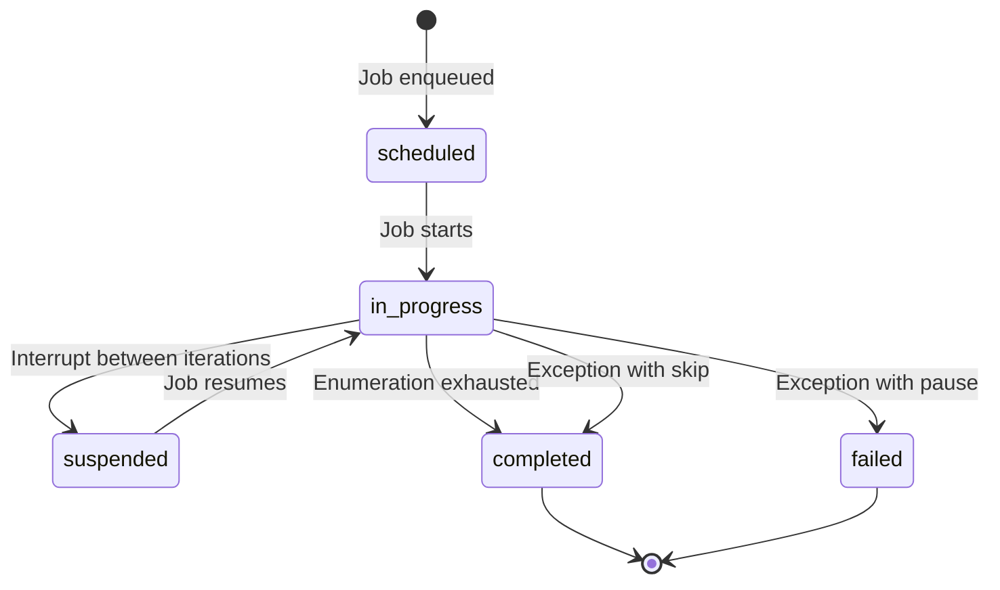
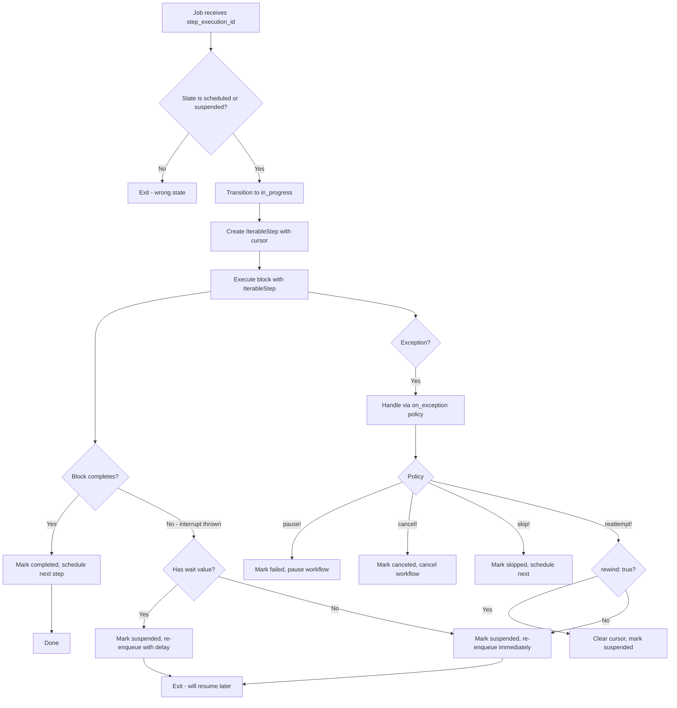

# Resumable Steps for GenevaDrive

## Executive Summary

This document proposes adding a `resumable_step` DSL to GenevaDrive that allows steps to iterate over large collections with cursor-based resumption. The block receives an **IterableStep object** with an API compatible with Rails 8.1's `ActiveJob::Continuation::Step`, providing familiar semantics for cursor management and checkpointing.

---

## 1. Background

### 1.1 Prior Art

Two existing solutions inform this design:

**Shopify's [job-iteration](https://github.com/Shopify/job-iteration)**:
- Separates enumeration setup from iteration logic
- Enumerator yields `[object, cursor]` pairs
- Automatic checkpointing between iterations

**Rails 8.1's [ActiveJob::Continuable](https://github.com/rails/rails/pull/55127)**:
- Block receives a `step` object with `cursor`, `set!`, `advance!`, `checkpoint!`
- User controls when to checkpoint
- Clean, explicit API

### 1.2 Why Match Rails 8.1's Step API?

We provide a `GenevaDrive::IterableStep` class that's **API-compatible** with `ActiveJob::Continuation::Step`:

1. **Familiarity** - Rails 8.1 users already know `set!`, `advance!`, `checkpoint!`, `cursor`, `resumed?`
2. **Documentation reuse** - can reference Rails docs for core API semantics
3. **Muscle memory** - same patterns work in both contexts
4. **No dependency** - works with Rails 7.x+, doesn't require Rails 8.1

We add GenevaDrive-specific extensions (like `iter.iterate_over`) on top of the compatible base.

### 1.3 Why Not Fibers?

While Ruby Fibers can suspend execution mid-block, they have critical limitations:

- **Fiber state cannot be serialized**: Can't persist to database, can't survive process restart
- **Fibers are bound to threads**: Can't resume in a different job worker process

The cursor pattern is simpler: on resume, user code rebuilds iteration state using the stored cursor (e.g., `WHERE id > cursor`).

---

## 2. Design Principles

### GenevaDrive Constraints

1. **Step executions are idempotent**: Pessimistic locking ensures no duplicate execution
2. **One active execution per workflow**: Unique constraint in database
3. **Flow control via throw/catch**: Existing mechanism for step interruption
4. **State stored in database**: Not in job serialization (unlike job-iteration)
5. **Steps are the atomic unit**: Resumable steps must remain steps, not become sub-workflows

### New Constraints for Resumable Steps

1. **Checkpoint persists cursor**: Each `checkpoint!` call saves cursor to database
2. **Track completed iterations**: Enables detection of infinitely looping steps
3. **Cursor preserved on reattempt**: By default, `reattempt!` continues from cursor position
4. **Optional rewind**: Use `reattempt!(rewind: true)` to restart from beginning

---

## 3. The IterableStep Object API

### 3.1 Rails 8.1 Compatible Core

The block receives a `GenevaDrive::IterableStep` object with the same core API as `ActiveJob::Continuation::Step`:

| Method | Description |
|--------|-------------|
| `iter.cursor` | Current cursor value (`nil` on first run) |
| `iter.resumed?` | `true` if resuming from prior suspension |
| `iter.advanced?` | `true` if cursor changed during this run |
| `iter.set!(value)` | Set cursor for the **next** iteration, then checkpoint |
| `iter.advance!` | Increment integer cursor via `+ 1`, then checkpoint. **Integers only.** |
| `iter.checkpoint!` | Persist cursor to DB, check for interruption |

### 3.2 Cursor Semantics

**The cursor is the value you'll receive on the next iteration.** When you call `set!(x)`, on resume `iter.cursor` returns exactly `x`. You decide what `x` means for your use case:

```ruby
# Record IDs: save last processed ID, query with > on resume
records.where("id > ?", iter.cursor || 0).find_each do |record|
  process(record)
  iter.set!(record.id)  # Next iteration will see this ID, query > it
end

# Page numbers: save the next page to fetch
iter.set!(page + 1)  # Next iteration starts from this page

# Opaque tokens: save the token for the next API call
iter.set!(response.next_page_token)  # Next iteration uses this token
```

### 3.3 Cursor Types

Cursors are serialized using **ActiveJob serializers**, so any type ActiveJob can serialize works automatically:

- **Integers, Strings**: Work directly
- **Opaque tokens** (API pagination tokens, UUIDs): Work directly
- **Date, Time, DateTime**: Serialized/deserialized automatically
- **BigDecimal, ActiveSupport::Duration**: Supported via AJ serializers

```ruby
# Integer cursor - advance! works
iter.advance!  # cursor 42 becomes 43

# Opaque token - use set! directly
iter.set!(response.next_page_token)  # "CiAKGjBpNDd2Nmp..."

# Date cursor - just works, no manual conversion needed
current = iter.cursor || Date.new(2024, 1, 1)
process_day(current)
iter.set!(current + 1)  # Date is serialized automatically
```

The `advance!` method raises `ArgumentError` if the cursor is not an `Integer`.

### 3.4 GenevaDrive Extensions

| Method | Description |
|--------|-------------|
| `iter.iterate_over(array)` | Iterate over stable array; uses index as cursor |
| `iter.iterate_over_records(relation, cursor: :id)` | Iterate over AR relation; uses `find_each`, column as cursor |
| `iter.iterate_over_record_batches(relation, batch_size:, cursor: :id)` | Iterate over batches; yields AR relation per batch |
| `iter.skip_to!(value, wait: nil)` | Set cursor, persist, suspend. Optional `wait:` for delayed re-enqueue |

---

## 4. Proposed DSL

### 4.1 Basic Usage - Manual Cursor Control

```ruby
class BulkNotificationWorkflow < GenevaDrive::Workflow
  belongs_to :campaign, class_name: "MarketingCampaign", foreign_key: :hero_id

  step :prepare_campaign do
    hero.update!(status: "sending")
  end

  resumable_step :send_notifications do |iter|
    hero.subscribers.where("id > ?", iter.cursor || 0).find_each do |subscriber|
      NotificationMailer.campaign(hero, subscriber).deliver_later
      iter.set!(subscriber.id)
    end
  end

  step :finalize do
    hero.update!(status: "sent", completed_at: Time.current)
  end
end
```

### 4.2 Iterating Over Records

For ActiveRecord relations, use `iterate_over_records`:

```ruby
resumable_step :send_notifications do |iter|
  iter.iterate_over_records(hero.subscribers) do |subscriber|
    NotificationMailer.campaign(hero, subscriber).deliver_later
  end
end
```

This:
- Uses `find_each` for memory-efficient batching
- Applies `WHERE id > cursor ORDER BY id`
- Auto-checkpoints after each record
- Checks for interruption after each record

With explicit cursor column:

```ruby
iter.iterate_over_records(hero.subscribers, cursor: :created_at) do |subscriber|
  # ...
end
```

### 4.3 Iterating Over Record Batches

For bulk operations, use `iterate_over_record_batches`. Each batch is an ActiveRecord relation, enabling efficient bulk operations:

```ruby
resumable_step :bulk_insert_notifications do |iter|
  iter.iterate_over_record_batches(hero.subscribers, batch_size: 500) do |batch_relation|
    # batch_relation is an AR relation - use bulk operations
    Notification.insert_all(
      batch_relation.pluck(:id).map { |id| { subscriber_id: id, campaign_id: hero.id } }
    )
  end
end

resumable_step :bulk_update_status do |iter|
  iter.iterate_over_record_batches(hero.subscribers, batch_size: 1000) do |batch_relation|
    # Can call update_all directly on the relation
    batch_relation.update_all(notified_at: Time.current)
  end
end
```

### 4.4 Iterating Over Arrays

For stable, in-memory arrays, use `iterate_over`:

```ruby
iter.iterate_over(items_array) do |item|
  process(item)
end
```

Uses index as cursor. **Only for stable arrays** - if the array changes between suspensions, the index will point to wrong items.

For date ranges or other sequences where items have natural cursor values, use manual loops (see section 4.6).

### 4.5 Opaque Token Pagination (e.g., Google APIs)

For APIs that return opaque page tokens, use a plain `loop` with `set!` and `skip_to!`:

```ruby
resumable_step :sync_gmail do |iter|
  loop do
    response = gmail.list_messages(page_token: iter.cursor)

    # skip_to! suspends and re-enqueues - no need for `next`
    iter.skip_to!(response.next_page_token) if response.empty_page?

    response.messages.each { |msg| process(msg) }

    break unless response.next_page_token
    iter.set!(response.next_page_token)
  end
end
```

The `skip_to!(value, wait: nil)` method:
- Sets and persists the cursor
- Throws `:interrupt` to suspend the step
- Re-enqueues for continuation from the new cursor
- Optional `wait:` delays the re-enqueue (for rate limiting)
- No need to remember `break` or `next`

### 4.6 Using advance! for Integer Cursors

For simple integer-based pagination:

```ruby
resumable_step :process_batches do |iter|
  total_batches = 100
  current = iter.cursor || 0

  while current < total_batches
    process_batch(current)
    iter.advance!  # cursor 0 becomes 1, etc.
  end
end
```

`advance!` only works with integers. For dates, use `set!` directly (ActiveJob serializers handle Date automatically):

```ruby
resumable_step :process_days do |iter|
  current = iter.cursor || Date.new(2024, 1, 1)

  while current <= Date.current
    process_day(current)
    current += 1
    iter.set!(current)  # Date is serialized automatically
  end
end
```

### 4.7 Rate-Limited APIs with Delayed Retry

For rate-limited APIs, use `skip_to!` with the `wait:` parameter:

```ruby
resumable_step :sync_external_api do |iter|
  page = iter.cursor || 1

  loop do
    response = ExternalApi.fetch(page: page)

    if response.rate_limited?
      # Suspend and retry after the rate limit expires
      iter.skip_to!(page, wait: response.retry_after)
    end

    break if response.empty?
    response.items.each { |item| process(item) }
    page += 1
    iter.set!(page)
  end
end
```

The `wait:` parameter:
- Persists the cursor immediately
- Suspends the step
- Re-enqueues the job with the specified delay
- Uses the same `throw :interrupt` mechanism as immediate `skip_to!`

This is consistent with GenevaDrive's flow control philosophy - all control flow uses `throw`, not exceptions.

### 4.8 DSL Method Signature

```ruby
resumable_step(name = nil,
  max_iterations: nil,         # Optional: interrupt after N total iterations
  max_runtime: nil,            # Optional: interrupt after duration
  on_exception: :pause!,       # Existing option
  **options,                   # Other step options (wait:, skip_if:, etc.)
  &block)                      # Required: block receiving step object
```

---

## 5. Database Schema Changes

### 5.1 Migration

```ruby
class AddResumableStepSupport < ActiveRecord::Migration[7.1]
  def change
    # Use database-native JSON type:
    # - PostgreSQL: jsonb (indexed, efficient, supports containment queries)
    # - MySQL 5.7+: json (native validation and storage)
    # - SQLite: text (with Rails JSON serialization - no native JSON type)
    if connection.adapter_name.downcase.include?('postgresql')
      add_column :geneva_drive_step_executions, :cursor, :jsonb
    else
      add_column :geneva_drive_step_executions, :cursor, :json
    end

    add_column :geneva_drive_step_executions, :completed_iterations, :integer, default: 0

    # Update unique constraint to include 'suspended' as an active state
    # The constraint ensures only one active step execution per workflow
    #
    # PostgreSQL:
    #   DROP INDEX index_step_executions_one_active_per_workflow;
    #   CREATE UNIQUE INDEX index_step_executions_one_active_per_workflow
    #   ON geneva_drive_step_executions (workflow_id)
    #   WHERE state IN ('scheduled', 'in_progress', 'suspended');
    #
    # MySQL: Update the generated column expression
    # SQLite: Recreate the partial index with the new WHERE clause
  end
end
```

**Why database-native JSON types?**
- **PostgreSQL JSONB**: Supports indexing, containment queries (`@>`), efficient storage
- **MySQL JSON**: Native validation, JSON path query support
- **SQLite**: Falls back to TEXT with Rails handling serialization transparently
- Rails automatically handles serialization/deserialization per adapter

### 5.2 Fast Checkpoint Updates

Checkpointing happens after every iteration, so it must be fast. Use `update_all` to bypass ActiveRecord callbacks and validations:

```ruby
def persist_cursor!(new_cursor)
  # Serialize cursor value using ActiveJob serializers (handles Date, Time, etc.)
  serialized = new_cursor.nil? ? nil : ActiveJob::Arguments.serialize([new_cursor]).first

  GenevaDrive::StepExecution
    .where(id: @step_execution.id)
    .update_all(
      cursor: serialized,  # Rails handles JSON encoding per database adapter
      completed_iterations: Arel.sql("completed_iterations + 1")
    )
end
```

**Why `update_all`?**
- Bypasses AR instantiation, callbacks, and validations
- Single SQL statement: `UPDATE ... SET cursor = ?, completed_iterations = completed_iterations + 1 WHERE id = ?`
- No `with_lock` needed—atomic increment via SQL
- Critical for high-throughput iteration (thousands of items per second)
- Rails automatically encodes to JSONB/JSON/TEXT based on database adapter

### 5.3 New State: `suspended`

Add to the `STATES` enum in `StepExecution`:

```ruby
class GenevaDrive::StepExecution < ActiveRecord::Base
  enum :state, {
    scheduled: "scheduled",
    in_progress: "in_progress",
    suspended: "suspended",      # NEW: paused between iterations
    completed: "completed",
    failed: "failed",
    canceled: "canceled",
    skipped: "skipped"
  }
end
```

### 5.4 Cursor Serialization

Cursors use ActiveJob's serialization system, which handles Date, Time, DateTime, BigDecimal, and other types automatically. With native JSON columns, Rails handles the JSON encoding/decoding transparently:

```ruby
# StepExecution additions
class GenevaDrive::StepExecution < ActiveRecord::Base
  # Rails automatically serializes/deserializes native JSON columns.
  # We wrap/unwrap for ActiveJob serializer compatibility (Date, Time, etc.)

  def cursor_value
    return nil if cursor.blank?
    ActiveJob::Arguments.deserialize([cursor]).first
  end

  def cursor_value=(value)
    if value.nil?
      self.cursor = nil
    else
      # ActiveJob serializers convert Date/Time/etc. to serializable hashes
      self.cursor = ActiveJob::Arguments.serialize([value]).first
    end
  end
end
```

This means users can store Dates directly without manual ISO8601 conversion:

```ruby
# Before (manual serialization)
current = iter.cursor ? Date.parse(iter.cursor) : start_date
iter.set!(current.iso8601)

# After (automatic via AJ serializers)
current = iter.cursor || start_date
iter.set!(current)
```

---

## 6. Execution Model

### 6.1 New Step State: `suspended`

Resumable steps introduce a new step execution state: **`suspended`**.

**Current states**: `scheduled`, `in_progress`, `completed`, `failed`, `canceled`, `skipped`

**New state**: `suspended` - The step has been paused between iterations with cursor saved, awaiting re-execution.

This provides:
- **Clear semantics**: Distinguishes "actively running right now" from "paused between iterations"
- **Better housekeeping**: Stuck `suspended` steps (job lost) are handled differently than stuck `in_progress` (process crashed mid-iteration)
- **Observability**: Query `step_executions.suspended` to see all paused resumable steps

**Active states for unique constraint**: `scheduled`, `in_progress`, `suspended`

### 6.2 State Diagram



### 6.3 Full Execution Flow



### 6.4 Interruption Conditions

The step suspends and re-enqueues when any of these are true:

1. **max_iterations reached**: Configurable limit per step
2. **max_runtime exceeded**: Time-based limit
3. **Queue adapter signals shutdown**: Sidekiq SIGTERM, etc.
4. **Workflow externally paused/canceled**: Checked periodically

---

## 7. Core Implementation

### 7.1 ResumableStepDefinition

```ruby
class GenevaDrive::ResumableStepDefinition < GenevaDrive::StepDefinition
  attr_reader :block, :max_iterations, :max_runtime

  def initialize(name:, max_iterations: nil, max_runtime: nil, **options, &block)
    @block = block
    @max_iterations = max_iterations
    @max_runtime = max_runtime
    super(name: name, callable: nil, **options)
  end

  def resumable?
    true
  end
end
```

### 7.2 DSL Addition to Workflow

```ruby
class GenevaDrive::Workflow < ActiveRecord::Base
  class << self
    def resumable_step(name = nil, **options, &block)
      raise ArgumentError, "resumable_step requires a block" unless block_given?

      name ||= generate_step_name

      definition = ResumableStepDefinition.new(
        name: name.to_s,
        **options,
        &block
      )

      steps.add(definition)
    end
  end
end
```

### 7.3 GenevaDrive::IterableStep Class

Rails 8.1 API-compatible object passed to resumable step blocks:

```ruby
class GenevaDrive::IterableStep
  attr_reader :name, :cursor

  def initialize(name, cursor, execution:, resumed:, executor:)
    @name = name.to_sym
    @cursor = cursor
    @execution = execution
    @resumed = resumed
    @executor = executor
    @advanced = false
  end

  # === Rails 8.1 ActiveJob::Continuation::Step compatible API ===

  def resumed? = @resumed
  def advanced? = @advanced

  # Set cursor to any value (integer, string, opaque token, etc.)
  def set!(value)
    @cursor = value
    @advanced = true
    checkpoint!
  end

  # Convenience for integer cursors only
  # Raises ArgumentError if cursor is not an Integer
  def advance!
    raise ArgumentError, "advance! requires integer cursor, got #{@cursor.inspect}" unless @cursor.is_a?(Integer)
    set!(@cursor + 1)
  end

  def checkpoint!
    persist_cursor!
    check_interruption!
  end

  def to_a = [name.to_s, cursor]
  def description = "at '#{name}', cursor '#{cursor.inspect}'"

  # === GenevaDrive Extensions ===

  # Skip to a new cursor position and suspend (re-enqueue job)
  # Use this in manual loops to jump ahead without forgetting `next` or `break`
  # Optional `wait:` parameter delays the re-enqueue (for rate limiting)
  def skip_to!(value, wait: nil)
    @cursor = value
    @advanced = true
    persist_cursor!
    throw :interrupt, wait  # nil or duration - force suspension and re-enqueue
  end

  # Iterate over any Enumerable (array, range, etc.) using index as cursor
  def iterate_over(enumerable)
    raise ArgumentError, "Must respond to #each" unless enumerable.respond_to?(:each)

    start_index = @cursor || 0
    enumerable.each_with_index do |element, index|
      next if index < start_index
      yield element
      set!(index + 1)
    end
  end

  # Iterate over AR relation using find_each, column value as cursor
  def iterate_over_records(relation, cursor: :id)
    filtered = if @cursor
      relation.where("#{cursor} > ?", @cursor).order(cursor => :asc)
    else
      relation.order(cursor => :asc)
    end

    filtered.find_each do |record|
      yield record
      set!(record.public_send(cursor))
    end
  end

  # Iterate over AR relation in batches, yielding each batch as an AR relation
  def iterate_over_record_batches(relation, batch_size:, cursor: :id)
    filtered = if @cursor
      relation.where("#{cursor} > ?", @cursor).order(cursor => :asc)
    else
      relation.order(cursor => :asc)
    end

    filtered.in_batches(of: batch_size) do |batch_relation|
      yield batch_relation
      # Get the max cursor value from this batch
      last_cursor = batch_relation.maximum(cursor)
      set!(last_cursor) if last_cursor
    end
  end

  private

  def persist_cursor!
    # Serialize cursor using ActiveJob serializers (handles Date, Time, etc.)
    serialized = @cursor.nil? ? nil : ActiveJob::Arguments.serialize([@cursor]).first

    # Fast update bypassing AR callbacks - critical for high-throughput iteration
    # Rails handles JSON encoding per database adapter (JSONB/JSON/TEXT)
    GenevaDrive::StepExecution
      .where(id: @execution.id)
      .update_all(
        cursor: serialized,
        completed_iterations: Arel.sql("completed_iterations + 1")
      )
  end

  def check_interruption!
    throw :interrupt if @executor.should_interrupt?
  end
end
```

### 7.4 ResumableStepExecutor

Orchestrates execution and passes IterableStep object to the block:

```ruby
class GenevaDrive::ResumableStepExecutor
  def initialize(step_execution)
    @step_execution = step_execution
    @workflow = step_execution.workflow
    @step_definition = @workflow.class.steps.named(step_execution.step_name)
    @start_time = nil
  end

  def execute!
    return unless valid_for_execution?

    transition_to_in_progress!
    @start_time = Time.current

    iter = GenevaDrive::IterableStep.new(
      @step_definition.name,
      @step_execution.cursor_value,
      execution: @step_execution,
      resumed: @step_execution.suspended?,
      executor: self
    )

    # catch(:interrupt) returns:
    # - :completed if block finishes normally
    # - nil if throw :interrupt (immediate re-enqueue)
    # - Duration/Numeric if throw :interrupt, wait (delayed re-enqueue)
    result = catch(:interrupt) do
      @workflow.instance_exec(iter, &@step_definition.block)
      :completed
    end

    case result
    when :completed
      complete_step!
    when ActiveSupport::Duration, Numeric
      suspend_and_continue!(wait: result)
    else
      suspend_and_continue!
    end

  rescue => e
    handle_exception(e)
  end

  def should_interrupt?
    return true if max_iterations_reached?
    return true if max_runtime_exceeded?
    return true if job_should_exit?
    return true if workflow_interrupted?
    false
  end

  private

  def valid_for_execution?
    @step_execution.scheduled? || @step_execution.suspended?
  end

  def transition_to_in_progress!
    @step_execution.with_lock do
      @step_execution.update!(
        state: "in_progress",
        started_at: @step_execution.started_at || Time.current
      )
    end
  end

  def max_iterations_reached?
    return false unless @step_definition.max_iterations
    @step_execution.reload.completed_iterations >= @step_definition.max_iterations
  end

  def max_runtime_exceeded?
    return false unless @step_definition.max_runtime
    Time.current - @start_time > @step_definition.max_runtime
  end

  def job_should_exit?
    Thread.current[:geneva_drive_should_exit] ||
      (defined?(Sidekiq) && Sidekiq.const_defined?(:CLI) &&
       Sidekiq::CLI.instance&.stopping?)
  end

  def workflow_interrupted?
    @workflow.reload
    @workflow.paused? || @workflow.canceled?
  end

  def suspend_and_continue!(wait: nil)
    @step_execution.with_lock do
      @step_execution.update!(state: "suspended")
    end

    job_options = @workflow.class.step_job_options
    job_options = job_options.merge(wait: wait) if wait

    GenevaDrive::PerformStepJob
      .set(job_options)
      .perform_later(@step_execution.id)
  end

  def complete_step!
    @step_execution.with_lock do
      @step_execution.update!(
        cursor: nil,
        state: "completed",
        outcome: "success",
        completed_at: Time.current
      )
    end
    @workflow.schedule_next_step!
  end
end
```

---

## 8. Flow Control Integration

### 8.1 Enhanced reattempt!

```ruby
module GenevaDrive::FlowControl
  def reattempt!(wait: nil, rewind: false)
    if rewind && current_execution
      current_execution.update!(cursor: nil, completed_iterations: 0)
    end
    throw :flow_control, FlowControlSignal.new(:reattempt, wait: wait)
  end
end
```

### 8.2 New suspend! Method

For manual suspension within iteration:

```ruby
module GenevaDrive::FlowControl
  def suspend!
    throw :flow_control, FlowControlSignal.new(:suspend)
  end
end
```

### 8.3 Existing Flow Control Still Works

Inside resumable steps, existing flow control methods work as expected:

```ruby
resumable_step :process_items do |iter|
  iter.iterate_over_records(hero.items) do |item|
    if item.invalid?
      skip!  # Skips entire step, moves to next step
    end

    if emergency_stop_requested?
      pause!  # Pauses entire workflow
    end

    process(item)
  end
end
```

---

## 9. Edge Cases

### 9.1 Empty Collection

If the collection is empty, the step completes immediately with zero iterations:

```ruby
resumable_step :process_items do |iter|
  iter.iterate_over_records(hero.items) do |item|  # If empty, block never executes
    process(item)
  end
end  # Step completes successfully
```

### 9.2 First-Run vs Resume

Use `iter.resumed?` to detect resumption:

```ruby
resumable_step :import do |iter|
  if iter.resumed?
    Rails.logger.info "Resuming import from cursor #{iter.cursor}"
  else
    Rails.logger.info "Starting import from beginning"
  end

  iter.iterate_over_records(records) { |r| import(r) }
end
```

### 9.3 Cursor Validation

Handle deleted records gracefully with manual iteration:

```ruby
resumable_step :process_records do |iter|
  start_id = iter.cursor || 0

  # Verify cursor is still valid (record might have been deleted)
  if iter.cursor && !Record.exists?(id: iter.cursor)
    Rails.logger.warn "Cursor record #{iter.cursor} deleted, finding next"
    start_id = Record.where("id > ?", iter.cursor).minimum(:id) || iter.cursor
  end

  Record.where("id > ?", start_id).find_each do |record|
    process(record)
    iter.set!(record.id)
  end
end
```

### 9.4 Infinite Loop Detection

With `completed_iterations` tracking, configure limits:

```ruby
resumable_step :process_items, max_iterations: 1_000_000 do |iter|
  iter.iterate_over_records(huge_collection) { |item| process(item) }
end
```

When exceeded, the step suspends. Housekeeping can detect and handle stuck steps.

---

## 10. Testing Helpers

### 10.1 Extensions to TestHelpers

```ruby
module GenevaDrive::TestHelpers
  # Run resumable step completely without interruption
  def speedrun_resumable_step(workflow, step_name)
    execution = workflow.current_execution
    with_interruption_disabled do
      ResumableStepExecutor.new(execution).execute!
    end
  end

  # Run N iterations then interrupt
  def run_iterations(workflow, step_name, count:)
    execution = workflow.current_execution
    with_max_iterations(count) do
      ResumableStepExecutor.new(execution).execute!
    end
  end

  # Assert cursor position
  def assert_cursor(workflow, expected_cursor)
    actual = workflow.current_execution&.cursor_value
    assert_equal expected_cursor, actual,
      "Expected cursor #{expected_cursor.inspect}, got #{actual.inspect}"
  end

  # Assert iteration count
  def assert_iterations(workflow, expected_count)
    actual = workflow.current_execution&.completed_iterations || 0
    assert_equal expected_count, actual,
      "Expected #{expected_count} iterations, got #{actual}"
  end
end
```

---

## 11. Comparison

| Aspect | job-iteration | Rails 8.1 Continuable | GenevaDrive |
|--------|---------------|----------------------|-------------|
| **API Style** | `build_enumerator` + `each_iteration` | `step` object in block | `IterableStep` object (Rails 8.1 compatible) |
| **Scope** | Any ActiveJob | Any ActiveJob | Workflow steps only |
| **State Storage** | Job serialization | Job serialization | `step_executions` table |
| **Checkpoint** | Configurable | Manual `set!`/`advance!` | Manual or auto via `iterate_over_*` |
| **Cursor Type** | Primitives only | Any serializable | Any AJ-serializable (native JSON/JSONB) |
| **Flow Control** | Limited | Limited | Full (cancel!, pause!, skip!, reattempt!) |
| **Rewind Support** | N/A | N/A | `reattempt!(rewind: true)` |

---

## 12. Implementation Plan

### Phase 1: Foundation
1. Add migration for `cursor` and `completed_iterations` columns
2. Add `suspended` state to `StepExecution`
3. Update unique constraint to include `suspended` state
4. Add cursor serialization helpers to `StepExecution`

### Phase 2: IterableStep Class
5. Create `GenevaDrive::IterableStep` class (Rails 8.1 API compatible)
6. Implement `cursor`, `set!`, `advance!`, `checkpoint!`, `resumed?`, `advanced?`
7. Implement `skip_to!(value, wait:)` for cursor jump with optional delayed re-enqueue
8. Implement `iterate_over` for Enumerables
9. Implement `iterate_over_records` for AR relations
10. Implement `iterate_over_record_batches` for batch processing

### Phase 3: Flow Control
11. Enhance `reattempt!` with `rewind:` option
12. Add `suspend!` flow control method

### Phase 4: Testing
13. Extend `TestHelpers` for resumable steps
14. Add comprehensive test suite

### Phase 5: Documentation
15. Document DSL usage
16. Add examples for common patterns

---

## 13. Open Questions

1. **Should there be a `progress` callback?**
   - Could report `(current_iteration, cursor)` for progress tracking
   - Useful for UI progress bars

2. **Should we support nested cursors?**
   - For multi-level iteration (e.g., iterate accounts, then transactions per account)
   - Cursor becomes an array of positions `[account_id, transaction_id]`
   - Adds complexity—perhaps defer to v2

3. **Should `iterate_over` support `[item, cursor]` pairs from Enumerators?**
   - Would allow custom Enumerators to specify their own cursor values
   - Currently uses index as cursor for all Enumerables

---

## 14. Summary

This design brings job-iteration's proven resumable iteration pattern to GenevaDrive while:

- Maintaining GenevaDrive's database-centric state model
- Preserving all existing flow control capabilities
- Guaranteeing safe resumption via per-iteration checkpointing
- Enabling infinite loop detection via iteration counting
- Providing a clean DSL that mirrors the existing `step` definition pattern

The `rewind: true` option for `reattempt!` gives developers explicit control over whether to continue from the cursor or start fresh—a capability job-iteration doesn't offer.
